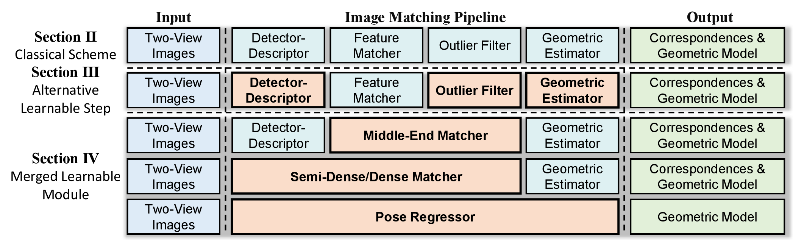
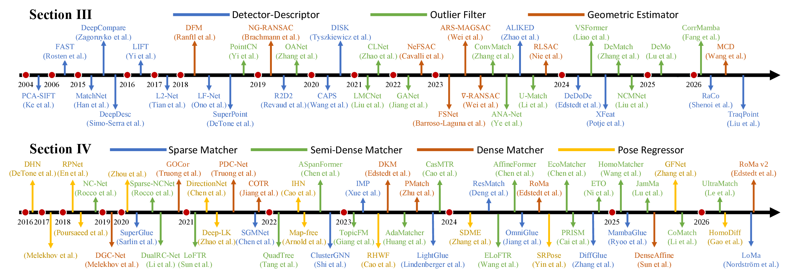
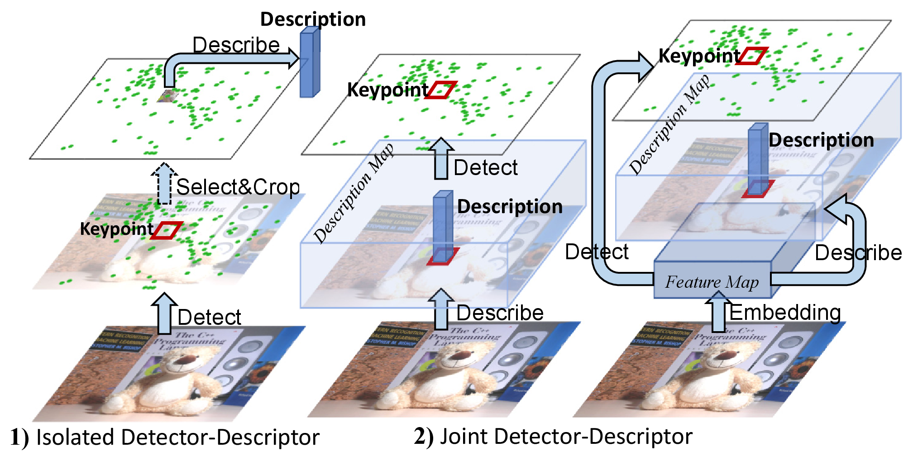
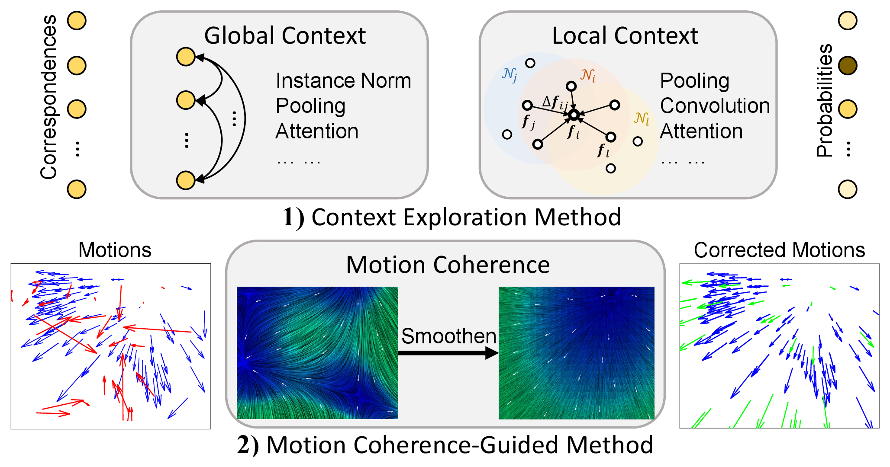
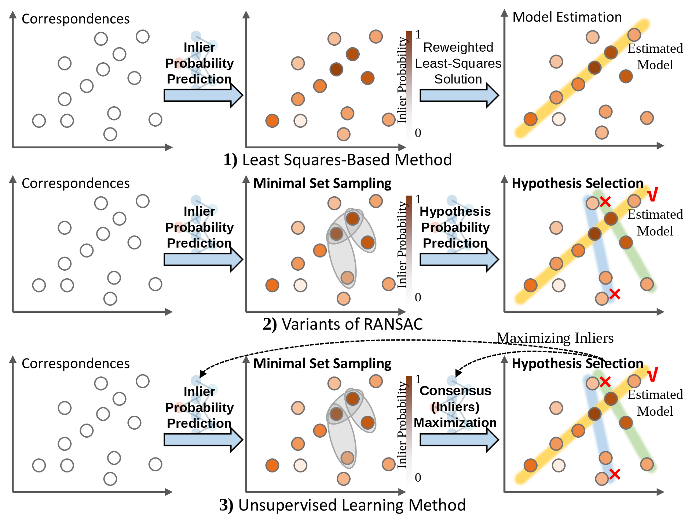
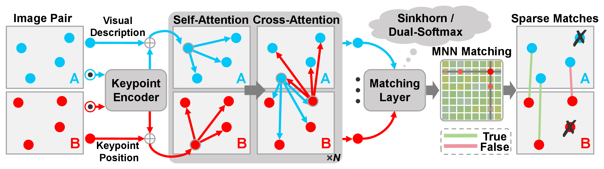
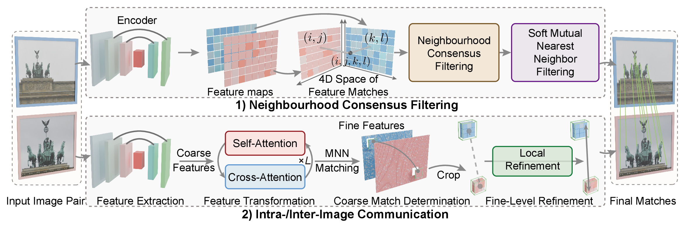
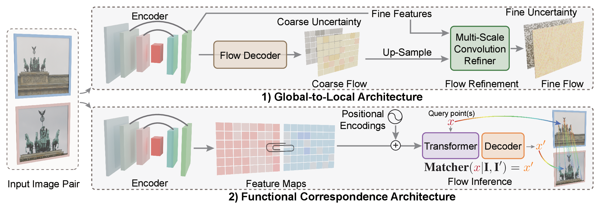
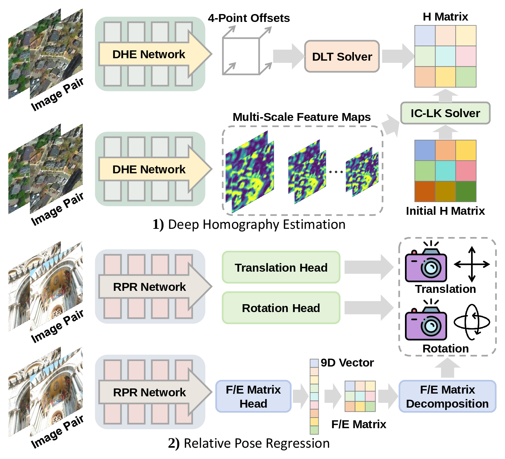

<!-- This file is generated by scripts/build_readme.py from data/papers.yaml and scripts/README.template.md. Edit those files, not README.md. -->

<div align="center">

<h1>Awesome Image Matching</h1>

<h3>Deep Learning Reforms Image Matching: A Survey and Outlook</h3>

<a href="https://arxiv.org/abs/2506.04619"></a>
<a href="#-contents"></a>
<a href="https://github.com/ZizhuoLi/awesome-image-matching-survey/stargazers"></a>
<a href="https://github.com/ZizhuoLi/awesome-image-matching-survey/network/members"></a>
<a href="https://github.com/ZizhuoLi/awesome-image-matching-survey/commits/main"></a>
<a href="https://github.com/ZizhuoLi/awesome-image-matching-survey/pulls"></a>

</div>

This repository accompanies our survey:

> **[Deep Learning Reforms Image Matching: A Survey and Outlook](https://arxiv.org/abs/2506.04619)**<br>
> Shihua Zhang<sup>1,†</sup>, Zizhuo Li<sup>1,†</sup>, Kaining Zhang<sup>2</sup>, Yifan Lu<sup>1</sup>, Yuxin Deng<sup>1</sup>, Linfeng Tang<sup>1</sup>, Xingyu Jiang<sup>3</sup>, Hao Zhang<sup>1</sup>, Jiayi Ma<sup>1,*</sup><br>
> <sup>1</sup>Wuhan University &nbsp; <sup>2</sup>Hunan University &nbsp; <sup>3</sup>Huazhong University of Science and Technology<br>
> <sup>†</sup>Equal contribution &nbsp; <sup>*</sup>Corresponding author

Image matching establishes correspondences between images to recover 3D structure and camera geometry. Our survey reviews how deep learning has progressively transformed the classical pipeline (detector-descriptor → feature matcher → outlier filter → geometric estimator), either by **replacing individual steps with learnable alternatives** or by **merging several steps into end-to-end learnable modules**. It also benchmarks representative methods on relative pose estimation, homography estimation, matching accuracy, visual localization, and 3D reconstruction.

This repository collects the **368 papers** discussed in the survey, organized by its taxonomy, with links to each paper and its official code.

> [!TIP]
> If you find this list useful, please give it a ⭐ and [cite our survey](#-citation). Missing a paper or spotted a mistake? [Open an issue](https://github.com/ZizhuoLi/awesome-image-matching-survey/issues/new/choose) or send a pull request (see [CONTRIBUTING.md](CONTRIBUTING.md)).

## 🔥 News

- **[2026-10]** The repository is rebuilt for the revised survey: 368 papers covering methods up to 2026, organized by the survey taxonomy, with paper and code links.
- **[2025-06]** The first version of the survey is released on [arXiv](https://arxiv.org/abs/2506.04619).

## 🧭 Overview

<p align="center">
  
</p>
<p align="center"><em>Taxonomy of image matching, aligned with the classical pipeline. Orange boxes mark the learnable components covered by the survey.</em></p>

<p align="center">
  
</p>
<p align="center"><em>Timeline of representative methods for alternative learnable steps (top) and merged learnable modules (bottom).</em></p>

## 📑 Contents

- [Classical Image Matching Pipeline](#-classical-image-matching-pipeline)
- [Alternative Learnable Step](#-alternative-learnable-step)
  - [Learnable Detector-Descriptor](#learnable-detector-descriptor)
    - [Learnable Detector](#learnable-detector)
    - [Learnable Descriptor](#learnable-descriptor)
    - [Cascaded Structure](#cascaded-structure)
    - [Branched Structure](#branched-structure)
    - [Decoupled Structure](#decoupled-structure)
    - [Application-Specific Features](#application-specific-features)
    - [Keypoint and Match Refinement](#keypoint-and-match-refinement)
  - [Learnable Outlier Filter](#learnable-outlier-filter)
    - [Context Exploration Method](#context-exploration-method)
    - [Motion Coherence-Guided Method](#motion-coherence-guided-method)
  - [Learnable Geometric Estimator](#learnable-geometric-estimator)
    - [Least Squares-Based Method](#least-squares-based-method)
    - [Learnable Minimal Set Sampling](#learnable-minimal-set-sampling)
    - [Learnable Hypothesis Selection](#learnable-hypothesis-selection)
    - [Unsupervised Learning Method](#unsupervised-learning-method)
- [Merged Learnable Module](#-merged-learnable-module)
  - [Middle-End Sparse Matcher](#middle-end-sparse-matcher)
  - [End-to-End Semi-Dense Matcher](#end-to-end-semi-dense-matcher)
    - [Neighbourhood Consensus Filtering](#neighbourhood-consensus-filtering)
    - [Intra-/Inter-Image Communication](#intra-inter-image-communication)
  - [End-to-End Dense Matcher](#end-to-end-dense-matcher)
    - [Global-to-Local Architecture](#global-to-local-architecture)
    - [Functional Correspondence Architecture](#functional-correspondence-architecture)
  - [Pose Regressor](#pose-regressor)
    - [Deep Homography Estimation](#deep-homography-estimation)
    - [Rotation-Translation Regression](#rotation-translation-regression)
    - [Fundamental/Essential Matrix Regression](#fundamentalessential-matrix-regression)
- [Datasets and Benchmarks](#-datasets-and-benchmarks)
- [Toolboxes](#-toolboxes)
- [Future Directions](#-future-directions)
  - [Generalization across Domains](#generalization-across-domains)
  - [Composability and Calibrated Uncertainty](#composability-and-calibrated-uncertainty)
  - [Efficiency at the System Level](#efficiency-at-the-system-level)
  - [From Pairwise to Multi-View Matching](#from-pairwise-to-multi-view-matching)
  - [Large Geometric Models](#large-geometric-models)
  - [Multi-Modal Matching](#multi-modal-matching)
- [Related Surveys and Evaluations](#-related-surveys-and-evaluations)

**How to read the tables.** 🌟 marks the representative methods shown in the survey's timeline. Paper links point to arXiv or open-access proceedings where possible, and to the publisher's page otherwise. The **Code** column links the official implementation (with its GitHub stars when hosted on GitHub); "—" means we did not find public code, and a few linked repositories are still waiting for the authors' code release. Rows are sorted by year, newest first.

## 📜 Classical Image Matching Pipeline

The handcrafted pipeline that learning-based methods build on (Section 2 of the survey): detectors and descriptors such as SIFT and ORB, consensus-based mismatch removal, and RANSAC-family robust estimators.

20 papers · [🔝 Back to top](#-contents)

<details>
<summary>Show 20 papers</summary>

| Method | Paper | Venue | Code |
|:--|:--|:--:|:--:|
| **Lin et al.** | [Illumination-Insensitive Binary Descriptor for Visual Measurement Based on Local Inter-Patch Invariance](https://arxiv.org/abs/2305.07943) | TIM 2023 | — |
| **MAGSAC++** | [MAGSAC++, a Fast, Reliable and Accurate Robust Estimator](https://arxiv.org/abs/1912.05909) | CVPR 2020 | [](https://github.com/danini/magsac) |
| **GC-RANSAC** | [Graph-Cut RANSAC](https://arxiv.org/abs/1706.00984) | CVPR 2018 | [](https://github.com/danini/graph-cut-ransac) |
| **GMS** | [GMS: Grid-Based Motion Statistics for Fast, Ultra-Robust Feature Correspondence](https://openaccess.thecvf.com/content_cvpr_2017/html/Bian_GMS_Grid-based_Motion_CVPR_2017_paper.html) | CVPR 2017 | [](https://github.com/JiawangBian/GMS-Feature-Matcher) |
| **VFC** | [Robust Point Matching via Vector Field Consensus](https://doi.org/10.1109/tip.2014.2307478) | TIP 2014 | [](https://github.com/jiayi-ma/VFC) |
| **USAC** | [USAC: A Universal Framework for Random Sample Consensus](https://doi.org/10.1109/tpami.2012.257) | TPAMI 2013 | — |
| **ORB** | [ORB: An Efficient Alternative to SIFT or SURF](https://doi.org/10.1109/iccv.2011.6126544) | ICCV 2011 | — |
| **BRIEF** | [BRIEF: Binary Robust Independent Elementary Features](https://doi.org/10.1007/978-3-642-15561-1_56) | ECCV 2010 | — |
| **IC-LK** | [Lucas-Kanade 20 Years On: A Unifying Framework](https://doi.org/10.1023/b:visi.0000011205.11775.fd) | IJCV 2004 | — |
| **MSER** | [Robust Wide-Baseline Stereo from Maximally Stable Extremal Regions](https://doi.org/10.1016/j.imavis.2004.02.006) | IVC 2004 | — |
| **SIFT** | [Distinctive Image Features from Scale-Invariant Keypoints](https://doi.org/10.1023/b:visi.0000029664.99615.94) | IJCV 2004 | — |
| **LO-RANSAC** | [Locally Optimized RANSAC](https://doi.org/10.1007/978-3-540-45243-0_31) | GCPR 2003 | — |
| **MLESAC** | [MLESAC: A New Robust Estimator with Application to Estimating Image Geometry](https://doi.org/10.1006/cviu.1999.0832) | CVIU 2000 | — |
| **SIFT** | [Object Recognition from Local Scale-Invariant Features](https://doi.org/10.1109/iccv.1999.790410) | ICCV 1999 | — |
| **Trajkovic and Hedley** | [Fast Corner Detection](https://doi.org/10.1016/S0262-8856(97)00056-5) | IVC 1998 | — |
| **Torr and Murray** | [The Development and Comparison of Robust Methods for Estimating the Fundamental Matrix](https://doi.org/10.1023/a:1007927408552) | IJCV 1997 | — |
| **Schmid and Mohr** | [Matching by Local Invariants](https://inria.hal.science/inria-00074046) | INRIA Tech. Report 1995 | — |
| **Shi-Tomasi** | [Good Features to Track](https://doi.org/10.1109/cvpr.1994.323794) | CVPR 1994 | — |
| **Harris** | [A Combined Corner and Edge Detector](https://doi.org/10.5244/c.2.23) | AVC 1988 | — |
| **RANSAC** | [Random Sample Consensus: A Paradigm for Model Fitting with Applications to Image Analysis and Automated Cartography](https://doi.org/10.1145/358669.358692) | Commun. ACM 1981 | — |

</details>

## 🧩 Alternative Learnable Step

Methods that replace **one step** of the classical pipeline with a learnable counterpart, while matching itself still relies on descriptor similarity (Section 3 of the survey).

### Learnable Detector-Descriptor

<p align="center">
  
</p>

<p align="center"><em>Frameworks of isolated and joint learnable detector-descriptors.</em></p>

Learnable replacements for keypoint detection and description, the first stage to be learned. Isolated methods learn the detector or the descriptor separately; joint methods detect and describe within one model, with cascaded, branched, or decoupled structures.

#### Learnable Detector

Learn where to detect keypoints that are reliable and repeatable across views.

*Isolated detector-descriptor* · 19 papers · [🔝 Back to top](#-contents)

| Method | Paper | Venue | Code |
|:--|:--|:--:|:--:|
| 🌟 **RaCo** | [RaCo: Ranking and Covariance for Practical Learned Keypoints](https://arxiv.org/abs/2602.15755) | 3DV 2026 | [](https://github.com/cvg/RaCo) |
| **DaD** | [DaD: Distilled Reinforcement Learning for Diverse Keypoint Detection](https://arxiv.org/abs/2503.07347) | arXiv 2025 | [](https://github.com/Parskatt/dad) |
| **MorseDet** | [Scale-Free Image Keypoints Using Differentiable Persistent Homology](https://arxiv.org/abs/2406.01315) | ICML 2024 | [](https://github.com/gbarbarani/MorseDet) |
| **Key.Net (TPAMI)** | [Key.Net: Keypoint Detection by Handcrafted and Learned CNN Filters Revisited](https://doi.org/10.1109/tpami.2022.3145820) | TPAMI 2023 | [](https://github.com/axelBarroso/Key.Net-Pytorch) |
| **NeSS-ST** | [NeSS-ST: Detecting Good and Stable Keypoints with a Neural Stability Score and the Shi-Tomasi Detector](https://arxiv.org/abs/2307.01069) | ICCV 2023 | [](https://github.com/KonstantinPakulev/NeSS-ST) |
| **REKD** | [Self-Supervised Equivariant Learning for Oriented Keypoint Detection](https://arxiv.org/abs/2204.08613) | CVPR 2022 | [](https://github.com/bluedream1121/REKD) |
| **D2D** | [D2D: Keypoint Extraction with Describe to Detect Approach](https://arxiv.org/abs/2005.13605) | ACCV 2020 | — |
| **ELF** | [ELF: Embedded Localisation of Features in Pre-Trained CNN](https://arxiv.org/abs/1907.03261) | ICCV 2019 | [](https://github.com/abenbihi/elf) |
| **Key.Net** | [Key.Net: Keypoint Detection by Handcrafted and Learned CNN Filters](https://arxiv.org/abs/1904.00889) | ICCV 2019 | [](https://github.com/axelBarroso/Key.Net) |
| **MagicPoint** | [Toward Geometric Deep SLAM](https://arxiv.org/abs/1707.07410) | arXiv 2017 | — |
| **Quad-Networks** | [Quad-Networks: Unsupervised Learning to Rank for Interest Point Detection](https://arxiv.org/abs/1611.07571) | CVPR 2017 | — |
| **TCDET** | [Learning Discriminative and Transformation Covariant Local Feature Detectors](https://openaccess.thecvf.com/content_cvpr_2017/html/Zhang_Learning_Discriminative_and_CVPR_2017_paper.html) | CVPR 2017 | [](https://github.com/ColumbiaDVMM/Transform_Covariant_Detector) |
| **Lenc et al.** | [Learning Covariant Feature Detectors](https://arxiv.org/abs/1605.01224) | ECCVW 2016 | [](https://github.com/lenck/ddet) |
| **TILDE** | [TILDE: A Temporally Invariant Learned DEtector](https://arxiv.org/abs/1411.4568) | CVPR 2015 | [](https://github.com/vcg-uvic/TILDE) |
| **Hartmann et al.** | [Predicting Matchability](https://openaccess.thecvf.com/content_cvpr_2014/html/Hartmann_Predicting_Matchability_2014_CVPR_paper.html) | CVPR 2014 | — |
| **Richardson and Olson** | [Learning Convolutional Filters for Interest Point Detection](https://doi.org/10.1109/icra.2013.6630639) | ICRA 2013 | — |
| **FAST-ER** | [Faster and Better: A Machine Learning Approach to Corner Detection](https://arxiv.org/abs/0810.2434) | TPAMI 2010 | — |
| 🌟 **FAST** | [Machine Learning for High-Speed Corner Detection](https://doi.org/10.1007/11744023_34) | ECCV 2006 | — |
| **Kienzle et al.** | [Learning an Interest Operator from Human Eye Movements](https://doi.org/10.1109/cvprw.2006.116) | CVPRW 2006 | — |

#### Learnable Descriptor

Learn discriminative descriptions of given keypoints that are invariant to viewpoint and appearance changes, from early metric learning to deep patch descriptors and context-aware descriptors.

*Isolated detector-descriptor* · 40 papers · [🔝 Back to top](#-contents)

| Method | Paper | Venue | Code |
|:--|:--|:--:|:--:|
| **CrossFeat** | [CrossFeat: Bridging Imaging Modalities in Feature Descriptor Space](https://arxiv.org/abs/2609.00272) | ECCV 2026 | [](https://github.com/paulschneider01/CrossFeat) |
| **SANDesc** | [A Streamlined Attention-Based Network for Descriptor Extraction](https://arxiv.org/abs/2601.13126) | 3DV 2026 | [](https://github.com/mattiadurso/SANDesc) |
| **MATCHA** | [MATCHA: Towards Matching Anything](https://openaccess.thecvf.com/content/CVPR2025/html/Xue_MATCHA_Towards_Matching_Anything_CVPR_2025_paper.html) | CVPR 2025 | [](https://github.com/nv-dvl/matcha) |
| **SDGMNet** | [SDGMNet: Statistic-Based Dynamic Gradient Modulation for Local Descriptor Learning](https://arxiv.org/abs/2106.04434) | AAAI 2024 | [](https://github.com/ACuOoOoO/SDGMNet) |
| **AWDesc** | [Attention Weighted Local Descriptors](https://doi.org/10.1109/tpami.2023.3266728) | TPAMI 2023 | [](https://github.com/vignywang/AWDesc) |
| **FeatureBooster** | [FeatureBooster: Boosting Feature Descriptors with a Lightweight Neural Network](https://arxiv.org/abs/2211.15069) | CVPR 2023 | [](https://github.com/SJTU-ViSYS/FeatureBooster) |
| **RELF** | [Learning Rotation-Equivariant Features for Visual Correspondence](https://arxiv.org/abs/2303.15472) | CVPR 2023 | [](https://github.com/bluedream1121/RELF) |
| **Shrestha et al.** | [Residual Learning for Image Point Descriptors](https://arxiv.org/abs/2312.15471) | arXiv 2023 | — |
| **MTLDesc** | [MTLDesc: Looking Wider to Describe Better](https://arxiv.org/abs/2203.07003) | AAAI 2022 | [](https://github.com/vignywang/MTLDesc) |
| **RoRD** | [RoRD: Rotation-Robust Descriptors and Orthographic Views for Local Feature Matching](https://arxiv.org/abs/2103.08573) | IROS 2021 | [](https://github.com/UditSinghParihar/RoRD) |
| 🌟 **CAPS** | [Learning Feature Descriptors using Camera Pose Supervision](https://arxiv.org/abs/2004.13324) | ECCV 2020 | [](https://github.com/qianqianwang68/caps) |
| **HyNet** | [HyNet: Learning Local Descriptor with Hybrid Similarity Measure and Triplet Loss](https://arxiv.org/abs/2006.10202) | NeurIPS 2020 | [](https://github.com/yuruntian/HyNet) |
| **LISRD** | [Online Invariance Selection for Local Feature Descriptors](https://arxiv.org/abs/2007.08988) | ECCV 2020 | [](https://github.com/rpautrat/LISRD) |
| **Toft et al.** | [Single-Image Depth Prediction Makes Feature Matching Easier](https://arxiv.org/abs/2008.09497) | ECCV 2020 | [](https://github.com/nianticlabs/rectified-features) |
| **ContextDesc** | [ContextDesc: Local Descriptor Augmentation with Cross-Modality Context](https://arxiv.org/abs/1904.04084) | CVPR 2019 | [](https://github.com/lzx551402/contextdesc) |
| **GIFT** | [GIFT: Learning Transformation-Invariant Dense Visual Descriptors via Group CNNs](https://arxiv.org/abs/1911.05932) | NeurIPS 2019 | [](https://github.com/zju3dv/GIFT) |
| **Log-Polar** | [Beyond Cartesian Representations for Local Descriptors](https://arxiv.org/abs/1908.05547) | ICCV 2019 | [](https://github.com/cvlab-epfl/log-polar-descriptors) |
| **Pultar et al.** | [Leveraging Outdoor Webcams for Local Descriptor Learning](https://arxiv.org/abs/1901.09780) | CVWW 2019 | [](https://github.com/pultarmi/AMOS_patches) |
| **SOSNet** | [SOSNet: Second Order Similarity Regularization for Local Descriptor Learning](https://arxiv.org/abs/1904.05019) | CVPR 2019 | [](https://github.com/scape-research/SOSNet) |
| **AffNet** | [Repeatability Is Not Enough: Learning Affine Regions via Discriminability](https://arxiv.org/abs/1711.06704) | ECCV 2018 | [](https://github.com/ducha-aiki/affnet) |
| **DOAP** | [Local Descriptors Optimized for Average Precision](https://arxiv.org/abs/1804.05312) | CVPR 2018 | [Code](https://kunhe.github.io/assets/DOAP/index.html) |
| **GeoDesc** | [GeoDesc: Learning Local Descriptors by Integrating Geometry Constraints](https://arxiv.org/abs/1807.06294) | ECCV 2018 | [](https://github.com/lzx551402/geodesc) |
| **Keller et al.** | [Learning Deep Descriptors with Scale-Aware Triplet Networks](https://openaccess.thecvf.com/content_cvpr_2018/html/Keller_Learning_Deep_Descriptors_CVPR_2018_paper.html) | CVPR 2018 | — |
| **GOR** | [Learning Spread-Out Local Feature Descriptors](https://arxiv.org/abs/1708.06320) | ICCV 2017 | [](https://github.com/ColumbiaDVMM/Spread-out_Local_Feature_Descriptor) |
| **HardNet** | [Working Hard to Know Your Neighbor's Margins: Local Descriptor Learning Loss](https://arxiv.org/abs/1705.10872) | NeurIPS 2017 | [](https://github.com/DagnyT/hardnet) |
| 🌟 **L2-Net** | [L2-Net: Deep Learning of Discriminative Patch Descriptor in Euclidean Space](https://openaccess.thecvf.com/content_cvpr_2017/html/Tian_L2-Net_Deep_Learning_CVPR_2017_paper.html) | CVPR 2017 | [](https://github.com/yuruntian/L2-Net) |
| **PN-Net** | [PN-Net: Conjoined Triple Deep Network for Learning Local Image Descriptors](https://arxiv.org/abs/1601.05030) | arXiv 2016 | [](https://github.com/vbalnt/pnnet) |
| **TFeat** | [Learning Local Feature Descriptors with Triplets and Shallow Convolutional Neural Networks](https://doi.org/10.5244/c.30.119) | BMVC 2016 | [](https://github.com/vbalnt/tfeat) |
| **TNet** | [Learning Local Image Descriptors with Deep Siamese and Triplet Convolutional Networks by Minimising Global Loss Functions](https://arxiv.org/abs/1512.09272) | CVPR 2016 | [](https://github.com/vijaykbg/deep-patchmatch) |
| 🌟 **DeepCompare** | [Learning to Compare Image Patches via Convolutional Neural Networks](https://arxiv.org/abs/1504.03641) | CVPR 2015 | [](https://github.com/szagoruyko/cvpr15deepcompare) |
| 🌟 **DeepDesc** | [Discriminative Learning of Deep Convolutional Feature Point Descriptors](https://openaccess.thecvf.com/content_iccv_2015/html/Simo-Serra_Discriminative_Learning_of_ICCV_2015_paper.html) | ICCV 2015 | [](https://github.com/etrulls/deepdesc-release) |
| 🌟 **MatchNet** | [MatchNet: Unifying Feature and Metric Learning for Patch-Based Matching](https://openaccess.thecvf.com/content_cvpr_2015/html/Han_MatchNet_Unifying_Feature_2015_CVPR_paper.html) | CVPR 2015 | [](https://github.com/hanxf/matchnet) |
| **Simonyan et al.** | [Learning Local Feature Descriptors Using Convex Optimisation](https://doi.org/10.1109/tpami.2014.2301163) | TPAMI 2014 | — |
| **BinBoost** | [Boosting Binary Keypoint Descriptors](https://openaccess.thecvf.com/content_cvpr_2013/html/Trzcinski_Boosting_Binary_Keypoint_2013_CVPR_paper.html) | CVPR 2013 | — |
| **LDAHash** | [LDAHash: Improved Matching with Smaller Descriptors](https://doi.org/10.1109/tpami.2011.103) | TPAMI 2012 | — |
| **Brown et al.** | [Discriminative Learning of Local Image Descriptors](https://doi.org/10.1109/tpami.2010.54) | TPAMI 2011 | — |
| **Cai et al.** | [Learning Linear Discriminant Projections for Dimensionality Reduction of Image Descriptors](https://doi.org/10.1109/tpami.2010.89) | TPAMI 2011 | — |
| **Hua et al.** | [Discriminant Embedding for Local Image Descriptors](https://doi.org/10.1109/iccv.2007.4408857) | ICCV 2007 | — |
| **Winder and Brown** | [Learning Local Image Descriptors](https://doi.org/10.1109/cvpr.2007.382971) | CVPR 2007 | — |
| 🌟 **PCA-SIFT** | [PCA-SIFT: A More Distinctive Representation for Local Image Descriptors](https://doi.org/10.1109/cvpr.2004.1315206) | CVPR 2004 | — |

#### Cascaded Structure

Detection and description are performed sequentially, either detect-then-describe (e.g., LIFT, LF-Net) or describe-then-detect (e.g., D2-Net).

*Joint detector-descriptor* · 8 papers · [🔝 Back to top](#-contents)

| Method | Paper | Venue | Code |
|:--|:--|:--:|:--:|
| **SGPFeat** | [SGPFeat: Semantic and Geometric Priors for Multi-Modal Image Matching](https://doi.org/10.1609/aaai.v40i5.37355) | AAAI 2026 | [](https://github.com/wbt6661/SGPFeat) |
| **ReDFeat** | [ReDFeat: Recoupling Detection and Description for Multimodal Feature Learning](https://arxiv.org/abs/2205.07439) | TIP 2023 | [](https://github.com/ACuOoOoO/ReDFeat) |
| **S-TREK** | [S-TREK: Sequential Translation and Rotation Equivariant Keypoints for Local Feature Extraction](https://arxiv.org/abs/2308.14598) | ICCV 2023 | — |
| **ASLFeat** | [ASLFeat: Learning Local Features of Accurate Shape and Localization](https://arxiv.org/abs/2003.10071) | CVPR 2020 | [](https://github.com/lzx551402/ASLFeat) |
| **D2-Net** | [D2-Net: A Trainable CNN for Joint Description and Detection of Local Features](https://arxiv.org/abs/1905.03561) | CVPR 2019 | [](https://github.com/mihaidusmanu/d2-net) |
| **RF-Net** | [RF-Net: An End-to-End Image Matching Network Based on Receptive Field](https://arxiv.org/abs/1906.00604) | CVPR 2019 | [](https://github.com/xuelunshen/rfnet) |
| 🌟 **LF-Net** | [LF-Net: Learning Local Features from Images](https://arxiv.org/abs/1805.09662) | NeurIPS 2018 | [](https://github.com/vcg-uvic/lf-net-release) |
| 🌟 **LIFT** | [LIFT: Learned Invariant Feature Transform](https://arxiv.org/abs/1603.09114) | ECCV 2016 | [](https://github.com/cvlab-epfl/LIFT) |

#### Branched Structure

A shared backbone feeds parallel detection and description heads (e.g., SuperPoint, R2D2, DISK, ALIKED).

*Joint detector-descriptor* · 24 papers · [🔝 Back to top](#-contents)

| Method | Paper | Venue | Code |
|:--|:--|:--:|:--:|
| **LARKED** | [LARKED: A Lightweight and Reliable Keypoint Detection Method for Feature Matching](https://doi.org/10.1016/j.cviu.2026.104780) | CVIU 2026 | — |
| **UPAL** | [Unified and Efficient Point-Line Local Features](https://arxiv.org/abs/2608.19894) | ECCV 2026 | [](https://github.com/francois141/upal) |
| **HLDD** | [HLDD: Hierarchically Learned Detector and Descriptor for Robust Image Matching](https://doi.org/10.1109/tip.2025.3568310) | TIP 2025 | — |
| **RIPE** | [RIPE: Reinforcement Learning on Unlabeled Image Pairs for Robust Keypoint Extraction](https://arxiv.org/abs/2507.04839) | ICCV 2025 | [](https://github.com/fraunhoferhhi/RIPE) |
| **SAMFeat** | [Segment Anything Model Is a Good Teacher for Local Feature Learning](https://arxiv.org/abs/2309.16992) | TIP 2025 | [](https://github.com/vignywang/SAMFeat) |
| **SDE2D** | [SDE2D: Semantic-Guided Discriminability Enhancement Feature Detector and Descriptor](https://doi.org/10.1109/tmm.2024.3521748) | TMM 2025 | [](https://github.com/Jasper-Lee2020/SDE2D) |
| **Wang et al.** | [Learning Local Features by Jointly Semantic-Guided and Task Rewards](https://doi.org/10.1109/tcsvt.2024.3490797) | TCSVT 2025 | — |
| **ALIKE** | [ALIKE: Accurate and Lightweight Keypoint Detection and Descriptor Extraction](https://arxiv.org/abs/2112.02906) | TMM 2023 | [](https://github.com/Shiaoming/ALIKE) |
| 🌟 **ALIKED** | [ALIKED: A Lighter Keypoint and Descriptor Extraction Network via Deformable Transformation](https://arxiv.org/abs/2304.03608) | TIM 2023 | [](https://github.com/Shiaoming/ALIKED) |
| **D2Former** | [D2Former: Jointly Learning Hierarchical Detectors and Contextual Descriptors via Agent-Based Transformers](https://openaccess.thecvf.com/content/CVPR2023/html/He_D2Former_Jointly_Learning_Hierarchical_Detectors_and_Contextual_Descriptors_via_Agent-Based_CVPR_2023_paper.html) | CVPR 2023 | — |
| **SFD2** | [SFD2: Semantic-Guided Feature Detection and Description](https://arxiv.org/abs/2304.14845) | CVPR 2023 | [](https://github.com/feixue94/sfd2) |
| **SiLK** | [SiLK -- Simple Learned Keypoints](https://arxiv.org/abs/2304.06194) | ICCV 2023 | [](https://github.com/facebookresearch/silk) |
| **TPR** | [Learning Transformation-Predictive Representations for Detection and Description of Local Features](https://openaccess.thecvf.com/content/CVPR2023/html/Wang_Learning_Transformation-Predictive_Representations_for_Detection_and_Description_of_Local_Features_CVPR_2023_paper.html) | CVPR 2023 | — |
| **ZippyPoint** | [ZippyPoint: Fast Interest Point Detection, Description, and Matching through Mixed Precision Discretization](https://arxiv.org/abs/2203.03610) | CVPRW 2023 | [](https://github.com/menelaoskanakis/ZippyPoint) |
| **Jung et al.** | [Local Feature Extraction from Salient Regions by Feature Map Transformation](https://arxiv.org/abs/2301.10413) | BMVC 2022 | [](https://github.com/annee23/BMVC2022_LocalFeature) |
| **LANet** | [Rethinking Low-Level Features for Interest Point Detection and Description](https://openaccess.thecvf.com/content/ACCV2022/html/Wang_Rethinking_Low-level_Features_for_Interest_Point_Detection_and_Description_ACCV_2022_paper.html) | ACCV 2022 | [](https://github.com/wangch-g/lanet) |
| **RaP-Net** | [RaP-Net: A Region-Wise and Point-Wise Weighting Network to Extract Robust Features for Indoor Localization](https://arxiv.org/abs/2012.00234) | IROS 2021 | [](https://github.com/ivipsourcecode/RaP-Net) |
| 🌟 **DISK** | [DISK: Learning Local Features with Policy Gradient](https://arxiv.org/abs/2006.13566) | NeurIPS 2020 | [](https://github.com/cvlab-epfl/disk) |
| **KP2D** | [Neural Outlier Rejection for Self-Supervised Keypoint Learning](https://arxiv.org/abs/1912.10615) | ICLR 2020 | [](https://github.com/TRI-ML/KP2D) |
| **Reinforced Feature Points** | [Reinforced Feature Points: Optimizing Feature Detection and Description for a High-Level Task](https://arxiv.org/abs/1912.00623) | CVPR 2020 | [](https://github.com/aritrabhowmik/Reinforced-Feature-Points) |
| **SEKD** | [SEKD: Self-Evolving Keypoint Detection and Description](https://arxiv.org/abs/2006.05077) | arXiv 2020 | [](https://github.com/aliyun/Self-Evolving-Keypoint-Demo) |
| 🌟 **R2D2** | [R2D2: Reliable and Repeatable Detector and Descriptor](https://arxiv.org/abs/1906.06195) | NeurIPS 2019 | [](https://github.com/naver/r2d2) |
| **UnsuperPoint** | [UnsuperPoint: End-to-End Unsupervised Interest Point Detector and Descriptor](https://arxiv.org/abs/1907.04011) | arXiv 2019 | — |
| 🌟 **SuperPoint** | [SuperPoint: Self-Supervised Interest Point Detection and Description](https://arxiv.org/abs/1712.07629) | CVPRW 2018 | [](https://github.com/magicleap/SuperPointPretrainedNetwork) |

#### Decoupled Structure

Detector and descriptor are trained separately but designed to work together (e.g., DeDoDe, XFeat, RDD).

*Joint detector-descriptor* · 11 papers · [🔝 Back to top](#-contents)

| Method | Paper | Venue | Code |
|:--|:--|:--:|:--:|
| **SemLight** | [SemLight: Distilled Semantic–Geometric Fusion for Efficient Local Feature Matching](https://doi.org/10.1007/978-3-032-37592-6_26) | ECCV 2026 | — |
| 🌟 **TraqPoint** | [From Pairs to Sequences: Track-Aware Policy Gradients for Keypoint Detection](https://arxiv.org/abs/2602.20630) | CVPR 2026 | [](https://github.com/xiaomi-research/traqpoint) |
| **LiftFeat** | [LiftFeat: 3D Geometry-Aware Local Feature Matching](https://arxiv.org/abs/2505.03422) | ICRA 2025 | [](https://github.com/lyp-deeplearning/LiftFeat) |
| **RDD** | [RDD: Robust Feature Detector and Descriptor using Deformable Transformer](https://arxiv.org/abs/2505.08013) | CVPR 2025 | [](https://github.com/xtcpete/rdd) |
| **AffSteer** | [Affine Steerers for Structured Keypoint Description](https://arxiv.org/abs/2408.14186) | ECCV 2024 | [](https://github.com/georg-bn/affine-steerers) |
| 🌟 **DeDoDe** | [DeDoDe: Detect, Don't Describe -- Describe, Don't Detect for Local Feature Matching](https://arxiv.org/abs/2308.08479) | 3DV 2024 | [](https://github.com/Parskatt/DeDoDe) |
| **DeDoDe v2** | [DeDoDe V2: Analyzing and Improving the DeDoDe Keypoint Detector](https://arxiv.org/abs/2404.08928) | CVPRW 2024 | [](https://github.com/Parskatt/DeDoDe) |
| **SCFeat** | [Shared Coupling-Bridge Scheme for Weakly Supervised Local Feature Learning](https://doi.org/10.1109/tmm.2023.3278172) | TMM 2024 | [](https://github.com/sunjiayuanro/SCFeat) |
| **Steerers** | [Steerers: A Framework for Rotation Equivariant Keypoint Descriptors](https://arxiv.org/abs/2312.02152) | CVPR 2024 | [](https://github.com/georg-bn/rotation-steerers) |
| 🌟 **XFeat** | [XFeat: Accelerated Features for Lightweight Image Matching](https://arxiv.org/abs/2404.19174) | CVPR 2024 | [](https://github.com/verlab/accelerated_features) |
| **PoSFeat** | [Decoupling Makes Weakly Supervised Local Feature Better](https://arxiv.org/abs/2201.02861) | CVPR 2022 | [](https://github.com/SYSU-SAIL/PoSFeat) |

#### Application-Specific Features

Local features tailored to texture images, retinal images, low-light and underwater scenes, deformable objects, motion blur, and specific robotics tasks.

*Learnable detector-descriptor* · 11 papers · [🔝 Back to top](#-contents)

| Method | Paper | Venue | Code |
|:--|:--|:--:|:--:|
| **Motion-Feat** | [Motion-Feat: Motion Blur-Aware Local Feature Description for Image Matching](https://doi.org/10.1109/iros60139.2025.11245810) | IROS 2025 | — |
| **Wang et al.** | [Degradation-Equivariant Representations for Robust Feature Detection and Description in Low-Light Environments](https://doi.org/10.1109/tmm.2025.3599075) | TMM 2025 | — |
| **BALF** | [BALF: Simple and Efficient Blur Aware Local Feature Detector](https://arxiv.org/abs/2211.14731) | WACV 2024 | [](https://github.com/ericzzj1989/BALF) |
| **Cadar et al.** | [Improving the Matching of Deformable Objects by Learning to Detect Keypoints](https://arxiv.org/abs/2309.00434) | PRL 2023 | [](https://github.com/verlab/LearningToDetect_PRL_2023) |
| **DALF** | [Enhancing Deformable Local Features by Jointly Learning to Detect and Describe Keypoints](https://arxiv.org/abs/2304.00583) | CVPR 2023 | [](https://github.com/verlab/DALF_CVPR_2023) |
| **DarkFeat** | [DarkFeat: Noise-Robust Feature Detector and Descriptor for Extremely Low-Light RAW Images](https://doi.org/10.1609/aaai.v37i1.25161) | AAAI 2023 | [](https://github.com/THU-LYJ-Lab/DarkFeat) |
| **Guo et al.** | [Descriptor Distillation for Efficient Multi-Robot SLAM](https://arxiv.org/abs/2303.08420) | ICRA 2023 | — |
| **Liu et al.** | [Learning Task-Aligned Local Features for Visual Localization](https://doi.org/10.1109/lra.2023.3268015) | RA-L 2023 | — |
| **Yang et al.** | [Knowledge Distillation for Feature Extraction in Underwater VSLAM](https://arxiv.org/abs/2303.17981) | ICRA 2023 | [](https://github.com/Jinghe-mel/UFEN-SLAM) |
| **SuperRetina** | [Semi-Supervised Keypoint Detector and Descriptor for Retinal Image Matching](https://arxiv.org/abs/2207.07932) | ECCV 2022 | [](https://github.com/ruc-aimc-lab/SuperRetina) |
| **Zhang and Rusinkiewicz** | [Learning to Detect Features in Texture Images](https://openaccess.thecvf.com/content_cvpr_2018/html/Zhang_Learning_to_Detect_CVPR_2018_paper.html) | CVPR 2018 | [](https://github.com/lg-zhang/pytorch-keypoint-release) |

#### Keypoint and Match Refinement

Refine the keypoints or matches produced by existing detectors instead of designing a new detector.

*Learnable detector-descriptor* · 3 papers · [🔝 Back to top](#-contents)

| Method | Paper | Venue | Code |
|:--|:--|:--:|:--:|
| **XRefine** | [XRefine: Attention-Guided Keypoint Match Refinement](https://arxiv.org/abs/2601.12530) | 3DV 2026 | [](https://github.com/boschresearch/xrefine) |
| **GMM-IKRS** | [GMM-IKRS: Gaussian Mixture Models for Interpretable Keypoint Refinement and Scoring](https://arxiv.org/abs/2408.17149) | ECCV 2024 | — |
| **Keypt2Subpx** | [Learning to Make Keypoints Sub-Pixel Accurate](https://arxiv.org/abs/2407.11668) | ECCV 2024 | [](https://github.com/KimSinjeong/keypt2subpx) |

### Learnable Outlier Filter

<p align="center">
  
</p>

<p align="center"><em>Frameworks of context exploration and motion coherence-guided outlier filters.</em></p>

Classify putative correspondences into inliers and outliers, usually from their coordinates alone.

#### Context Exploration Method

Aggregate global and local context from other correspondences with normalization, pooling, graphs, attention, or state-space models.

*Learnable outlier filter* · 22 papers · [🔝 Back to top](#-contents)

| Method | Paper | Venue | Code |
|:--|:--|:--:|:--:|
| **CLCT** | [CLCT: Complementary Local Consensus Transformer for Two-View Correspondence Pruning](https://doi.org/10.1109/tmm.2026.3687024) | TMM 2026 | — |
| 🌟 **CorrMamba** | [Selecting and Pruning: A Differentiable Causal Sequentialized State-Space Model for Two-View Correspondence Learning](https://arxiv.org/abs/2503.17938) | TIP 2026 | — |
| **LeCoT** | [LeCoT: Revisiting Network Architecture for Two-View Correspondence Pruning](https://arxiv.org/abs/2511.07078) | SCIS 2026 | [](https://github.com/Dailuanyuan2024/LeCoT-Revisiting-Network-Architecture-for-Two-View-Correspondence-Pruning) |
| **Liao et al.** | [Scalable and Generalizable Correspondence Pruning via Geometry-Consistent Pre-Training](https://arxiv.org/abs/2406.05773) | TPAMI 2026 | [](https://github.com/sugar-fly/GeneralPruner) |
| **BCLNet** | [BCLNet: Bilateral Consensus Learning for Two-View Correspondence Pruning](https://arxiv.org/abs/2401.03459) | AAAI 2024 | [](https://github.com/guobaoxiao/BCLNet) |
| **MGNet** | [MGNet: Learning Correspondences via Multiple Graphs](https://arxiv.org/abs/2401.04984) | AAAI 2024 | — |
| **NCMNet (TPAMI)** | [NCMNet: Neighbor Consistency Mining Network for Two-View Correspondence Pruning](https://doi.org/10.1109/tpami.2024.3462453) | TPAMI 2024 | [](https://github.com/xinliu29/NCMNet) |
| **T-Net++** | [T-Net++: Effective Permutation-Equivariance Network for Two-View Correspondence Pruning](https://doi.org/10.1109/tpami.2024.3444457) | TPAMI 2024 | [](https://github.com/guobaoxiao/T-Net) |
| **U-Match (TPAMI)** | [U-Match: Exploring Hierarchy-Aware Local Context for Two-View Correspondence Learning](https://doi.org/10.1109/tpami.2024.3447048) | TPAMI 2024 | [](https://github.com/ZizhuoLi/U-Match) |
| 🌟 **VSFormer** | [VSFormer: Visual-Spatial Fusion Transformer for Correspondence Pruning](https://arxiv.org/abs/2312.08774) | AAAI 2024 | [](https://github.com/sugar-fly/VSFormer) |
| 🌟 **ANA-Net** | [Learning Second-Order Attentive Context for Efficient Correspondence Pruning](https://arxiv.org/abs/2303.15761) | AAAI 2023 | [](https://github.com/DIVE128/ANANet) |
| 🌟 **NCMNet** | [Progressive Neighbor Consistency Mining for Correspondence Pruning](https://openaccess.thecvf.com/content/CVPR2023/html/Liu_Progressive_Neighbor_Consistency_Mining_for_Correspondence_Pruning_CVPR_2023_paper.html) | CVPR 2023 | [](https://github.com/xinliu29/NCMNet) |
| 🌟 **U-Match** | [U-Match: Two-View Correspondence Learning with Hierarchy-Aware Local Context Aggregation](https://doi.org/10.24963/ijcai.2023/130) | IJCAI 2023 | [](https://github.com/ZizhuoLi/U-Match) |
| 🌟 **GANet** | [Learning for Mismatch Removal via Graph Attention Networks](https://doi.org/10.1016/j.isprsjprs.2022.06.009) | ISPRS J 2022 | [](https://github.com/StaRainJ/Code-of-GANet) |
| **MS²DG-Net** | [MS2DG-Net: Progressive Correspondence Learning via Multiple Sparse Semantics Dynamic Graph](https://openaccess.thecvf.com/content/CVPR2022/html/Dai_MS2DG-Net_Progressive_Correspondence_Learning_via_Multiple_Sparse_Semantics_Dynamic_Graph_CVPR_2022_paper.html) | CVPR 2022 | [](https://github.com/changcaiyang/MS2DG-Net) |
| **OANet (TPAMI)** | [OANet: Learning Two-View Correspondences and Geometry Using Order-Aware Network](https://doi.org/10.1109/tpami.2020.3048013) | TPAMI 2022 | [](https://github.com/zjhthu/OANet) |
| 🌟 **CLNet** | [Progressive Correspondence Pruning by Consensus Learning](https://arxiv.org/abs/2101.00591) | ICCV 2021 | [](https://github.com/sailor-z/CLNet) |
| **PointACN** | [ACNe: Attentive Context Normalization for Robust Permutation-Equivariant Learning](https://arxiv.org/abs/1907.02545) | CVPR 2020 | [](https://github.com/vcg-uvic/acne) |
| **LMR** | [LMR: Learning a Two-Class Classifier for Mismatch Removal](https://doi.org/10.1109/tip.2019.2906490) | TIP 2019 | [](https://github.com/StaRainJ/LMR) |
| **NM-Net** | [NM-Net: Mining Reliable Neighbors for Robust Feature Correspondences](https://arxiv.org/abs/1904.00320) | CVPR 2019 | [](https://github.com/sailor-z/NM-Net) |
| 🌟 **OANet** | [Learning Two-View Correspondences and Geometry Using Order-Aware Network](https://arxiv.org/abs/1908.04964) | ICCV 2019 | [](https://github.com/zjhthu/OANet) |
| 🌟 **PointCN** | [Learning to Find Good Correspondences](https://arxiv.org/abs/1711.05971) | CVPR 2018 | [](https://github.com/vcg-uvic/learned-correspondence-release) |

#### Motion Coherence-Guided Method

Explicitly estimate or regularize the smooth motion field formed by inliers, and identify inliers by their consistency with it.

*Learnable outlier filter* · 9 papers · [🔝 Back to top](#-contents)

| Method | Paper | Venue | Code |
|:--|:--|:--:|:--:|
| **GeoMoE** | [GeoMoE: Divide-and-Conquer Motion Field Modeling with Mixture-of-Experts for Two-View Geometry](https://arxiv.org/abs/2508.00592) | AAAI 2026 | [](https://github.com/JiajunLe/GeoMoE) |
| **SC-Net** | [SC-Net: Robust Correspondence Learning via Spatial and Cross-Channel Context](https://arxiv.org/abs/2512.23473) | AAAI 2026 | [](https://github.com/shuyuanlin/SCNet) |
| **CorrNeXt** | [CorrNeXt: Making the ConvNet-Style Correspondence Pruner Stronger for Two-View Geometry](https://doi.org/10.1145/3746027.3755350) | ACM MM 2025 | — |
| **DeMatch++** | [DeMatch++: Two-View Correspondence Learning via Deep Motion Field Decomposition and Respective Local-Context Aggregation](https://doi.org/10.1109/tpami.2025.3596598) | TPAMI 2025 | [](https://github.com/SuhZhang/DeMatchPlus) |
| 🌟 **DeMo** | [DeMo: Deep Motion Field Consensus with Learnable Kernels for Two-View Correspondence Learning](https://doi.org/10.1609/aaai.v39i6.32622) | AAAI 2025 | [](https://github.com/JiajunLe/DeMo) |
| **ConvMatch (TPAMI)** | [ConvMatch: Rethinking Network Design for Two-View Correspondence Learning](https://doi.org/10.1109/tpami.2023.3334515) | TPAMI 2024 | [](https://github.com/SuhZhang/ConvMatch) |
| 🌟 **DeMatch** | [DeMatch: Deep Decomposition of Motion Field for Two-View Correspondence Learning](https://openaccess.thecvf.com/content/CVPR2024/html/Zhang_DeMatch_Deep_Decomposition_of_Motion_Field_for_Two-View_Correspondence_Learning_CVPR_2024_paper.html) | CVPR 2024 | [](https://github.com/SuhZhang/DeMatch) |
| 🌟 **ConvMatch** | [ConvMatch: Rethinking Network Design for Two-View Correspondence Learning](https://doi.org/10.1609/aaai.v37i3.25456) | AAAI 2023 | [](https://github.com/SuhZhang/ConvMatch) |
| 🌟 **LMCNet** | [Learnable Motion Coherence for Correspondence Pruning](https://arxiv.org/abs/2011.14563) | CVPR 2021 | [](https://github.com/liuyuan-pal/LMCNet) |

### Learnable Geometric Estimator

<p align="center">
  
</p>

<p align="center"><em>Frameworks of least squares-based, RANSAC-variant, and unsupervised learnable estimators.</em></p>

Learnable components that operate inside model estimation, i.e., in solving, minimal-set sampling, or hypothesis scoring.

#### Least Squares-Based Method

Iteratively reweighted least squares with learned correspondence weights.

*Learnable geometric estimator* · 1 paper · [🔝 Back to top](#-contents)

| Method | Paper | Venue | Code |
|:--|:--|:--:|:--:|
| 🌟 **DFM** | [Deep Fundamental Matrix Estimation](https://openaccess.thecvf.com/content_ECCV_2018/html/Rene_Ranftl_Deep_Fundamental_Matrix_ECCV_2018_paper.html) | ECCV 2018 | [](https://github.com/isl-org/DFE) |

#### Learnable Minimal Set Sampling

Learn where RANSAC should sample minimal sets.

*Variants of RANSAC* · 5 papers · [🔝 Back to top](#-contents)

| Method | Paper | Venue | Code |
|:--|:--|:--:|:--:|
| 🌟 **MCD** | [Monte Carlo Diffusion for Generalizable Learning-Based RANSAC](https://arxiv.org/abs/2503.09410) | AAAI 2026 | [](https://github.com/comedy0913/MCD) |
| 🌟 **ARS-MAGSAC** | [Adaptive Reordering Sampler with Neurally Guided MAGSAC](https://arxiv.org/abs/2111.14093) | ICCV 2023 | [](https://github.com/weitong8591/ars_magsac) |
| **BANSAC** | [BANSAC: A Dynamic BAyesian Network for Adaptive SAmple Consensus](https://arxiv.org/abs/2309.08690) | ICCV 2023 | [](https://github.com/merlresearch/BANSAC) |
| 🌟 **∇-RANSAC** | [Generalized Differentiable RANSAC](https://arxiv.org/abs/2212.13185) | ICCV 2023 | [](https://github.com/weitong8591/differentiable_ransac) |
| 🌟 **NG-RANSAC** | [Neural-Guided RANSAC: Learning Where to Sample Model Hypotheses](https://arxiv.org/abs/1905.04132) | ICCV 2019 | [](https://github.com/vislearn/ngransac) |

#### Learnable Hypothesis Selection

Learn to score hypotheses or to reject unpromising minimal samples before model estimation.

*Variants of RANSAC* · 4 papers · [🔝 Back to top](#-contents)

| Method | Paper | Venue | Code |
|:--|:--|:--:|:--:|
| 🌟 **FSNet** | [Two-View Geometry Scoring Without Correspondences](https://arxiv.org/abs/2306.01596) | CVPR 2023 | [](https://github.com/nianticlabs/scoring-without-correspondences) |
| **MQ-Net** | [Learning to Find Good Models in RANSAC](https://openaccess.thecvf.com/content/CVPR2022/html/Barath_Learning_To_Find_Good_Models_in_RANSAC_CVPR_2022_paper.html) | CVPR 2022 | [](https://github.com/danini/learning-good-models-in-ransac) |
| 🌟 **NeFSAC** | [NeFSAC: Neurally Filtered Minimal Samples](https://arxiv.org/abs/2207.07872) | ECCV 2022 | [](https://github.com/cavalli1234/NeFSAC) |
| **DSAC** | [DSAC - Differentiable RANSAC for Camera Localization](https://arxiv.org/abs/1611.05705) | CVPR 2017 | [](https://github.com/cvlab-dresden/DSAC) |

#### Unsupervised Learning Method

Learn consensus maximization without ground-truth models, e.g., with reinforcement learning.

*Learnable geometric estimator* · 4 papers · [🔝 Back to top](#-contents)

| Method | Paper | Venue | Code |
|:--|:--|:--:|:--:|
| 🌟 **RLSAC** | [RLSAC: Reinforcement Learning Enhanced Sample Consensus for End-to-End Robust Estimation](https://arxiv.org/abs/2308.05318) | ICCV 2023 | [](https://github.com/IRMVLab/RLSAC) |
| **Truong et al. (TPAMI)** | [Unsupervised Learning for Maximum Consensus Robust Fitting: A Reinforcement Learning Approach](https://doi.org/10.1109/tpami.2022.3178442) | TPAMI 2023 | — |
| **Truong et al.** | [Unsupervised Learning for Robust Fitting: A Reinforcement Learning Approach](https://openaccess.thecvf.com/content/CVPR2021/html/Truong_Unsupervised_Learning_for_Robust_Fitting_A_Reinforcement_Learning_Approach_CVPR_2021_paper.html) | CVPR 2021 | [](https://github.com/hagianga21/MaxCon_RL) |
| **Probst et al.** | [Unsupervised Learning of Consensus Maximization for 3D Vision Problems](https://openaccess.thecvf.com/content_CVPR_2019/html/Probst_Unsupervised_Learning_of_Consensus_Maximization_for_3D_Vision_Problems_CVPR_2019_paper.html) | CVPR 2019 | — |

## 🔗 Merged Learnable Module

Methods that **merge several consecutive steps** of the classical pipeline into one network (Section 4 of the survey).

### Middle-End Sparse Matcher

<p align="center">
  
</p>

<p align="center"><em>Framework of middle-end sparse matchers.</em></p>

Merge the feature matcher and the outlier filter. Attention-based graph neural networks jointly reason over keypoint positions and descriptors and solve an assignment problem.

19 papers · [🔝 Back to top](#-contents)

| Method | Paper | Venue | Code |
|:--|:--|:--:|:--:|
| **CFM** | [Collaborative Feature Matching with Progressive Correspondence Learning](https://doi.org/10.1609/aaai.v40i9.37669) | AAAI 2026 | [](https://github.com/xinliu29/CFM) |
| 🌟 **LoMa** | [LoMa: Local Feature Matching Revisited](https://arxiv.org/abs/2604.04931) | ECCV 2026 | [](https://github.com/davnords/LoMa) |
| **MapGlue** | [MapGlue: Multimodal Remote Sensing Image Matching](https://arxiv.org/abs/2503.16185) | ISPRS J 2026 | [](https://github.com/PeihaoWu/MapGlue) |
| **Match Any Keypoints** | [Match Any Keypoints](https://doi.org/10.1109/tip.2026.3677666) | TIP 2026 | — |
| **SceneGlue** | [SceneGlue: Scene-Aware Transformer for Feature Matching without Scene-Level Annotation](https://arxiv.org/abs/2604.13941) | TCSVT 2026 | [](https://github.com/songlin-du/SceneGlue) |
| **SGAT** | [SGAT: Learning Feature Matching with Singularity-Enhanced Graph Attention Network](https://doi.org/10.1609/aaai.v40i15.38294) | AAAI 2026 | [](https://github.com/tasi-z/SGAT) |
| **MaKeGNN** | [Learning Feature Matching via Matchable Keypoint-Assisted Graph Neural Network](https://arxiv.org/abs/2307.01447) | TIP 2025 | — |
| 🌟 **MambaGlue** | [MambaGlue: Fast and Robust Local Feature Matching With Mamba](https://arxiv.org/abs/2502.00462) | ICRA 2025 | [](https://github.com/url-kaist/MambaGlue) |
| **SemaGlue** | [Matching While Perceiving: Enhance Image Feature Matching with Applicable Semantic Amalgamation](https://doi.org/10.1609/aaai.v39i10.33095) | AAAI 2025 | [](https://github.com/ZeJ-Zhu/SemaGlue) |
| 🌟 **DiffGlue** | [DiffGlue: Diffusion-Aided Image Feature Matching](https://doi.org/10.1145/3664647.3681069) | ACM MM 2024 | [](https://github.com/SuhZhang/DiffGlue) |
| 🌟 **OmniGlue** | [OmniGlue: Generalizable Feature Matching with Foundation Model Guidance](https://arxiv.org/abs/2405.12979) | CVPR 2024 | [](https://github.com/google-research/omniglue) |
| 🌟 **ResMatch** | [ResMatch: Residual Attention Learning for Feature Matching](https://arxiv.org/abs/2307.05180) | AAAI 2024 | [](https://github.com/ACuOoOoO/ResMatch) |
| 🌟 **IMP** | [IMP: Iterative Matching and Pose Estimation with Adaptive Pooling](https://arxiv.org/abs/2304.14837) | CVPR 2023 | [](https://github.com/feixue94/imp-release) |
| 🌟 **LightGlue** | [LightGlue: Local Feature Matching at Light Speed](https://arxiv.org/abs/2306.13643) | ICCV 2023 | [](https://github.com/cvg/LightGlue) |
| **ParaFormer** | [ParaFormer: Parallel Attention Transformer for Efficient Feature Matching](https://arxiv.org/abs/2303.00941) | AAAI 2023 | — |
| **SAM** | [Scene-Aware Feature Matching](https://arxiv.org/abs/2308.09949) | ICCV 2023 | — |
| 🌟 **ClusterGNN** | [ClusterGNN: Cluster-Based Coarse-to-Fine Graph Neural Network for Efficient Feature Matching](https://arxiv.org/abs/2204.11700) | CVPR 2022 | — |
| 🌟 **SGMNet** | [Learning to Match Features with Seeded Graph Matching Network](https://arxiv.org/abs/2108.08771) | ICCV 2021 | [](https://github.com/vdvchen/SGMNet) |
| 🌟 **SuperGlue** | [SuperGlue: Learning Feature Matching with Graph Neural Networks](https://arxiv.org/abs/1911.11763) | CVPR 2020 | [](https://github.com/magicleap/SuperGluePretrainedNetwork) |

### End-to-End Semi-Dense Matcher

<p align="center">
  
</p>

<p align="center"><em>Frameworks of end-to-end semi-dense matchers.</em></p>

Detector-free matchers that match coarse patches directly from the image pair and then refine the matches to sub-pixel accuracy.

#### Neighbourhood Consensus Filtering

Regularize a 4D correlation volume with (sparse) 4D convolutions to enforce neighbourhood consensus.

*Semi-dense matcher* · 6 papers · [🔝 Back to top](#-contents)

| Method | Paper | Venue | Code |
|:--|:--|:--:|:--:|
| **DualRC-L** | [DualRC: A Dual-Resolution Learning Framework With Neighbourhood Consensus for Visual Correspondences](https://doi.org/10.1109/tpami.2023.3316770) | TPAMI 2024 | [](https://github.com/ActiveVisionLab/DualRC-Net) |
| **EDCNet** | [Efficient Dynamic Correspondence Network](https://doi.org/10.1109/tip.2023.3334594) | TIP 2024 | — |
| **Patch2Pix** | [Patch2Pix: Epipolar-Guided Pixel-Level Correspondences](https://arxiv.org/abs/2012.01909) | CVPR 2021 | [](https://github.com/GrumpyZhou/patch2pix) |
| 🌟 **DualRC-Net** | [Dual-Resolution Correspondence Networks](https://arxiv.org/abs/2006.08844) | NeurIPS 2020 | [](https://github.com/ActiveVisionLab/DualRC-Net) |
| 🌟 **Sparse-NCNet** | [Efficient Neighbourhood Consensus Networks via Submanifold Sparse Convolutions](https://arxiv.org/abs/2004.10566) | ECCV 2020 | [](https://github.com/ignacio-rocco/sparse-ncnet) |
| 🌟 **NC-Net** | [Neighbourhood Consensus Networks](https://arxiv.org/abs/1810.10510) | NeurIPS 2018 | [](https://github.com/ignacio-rocco/ncnet) |

#### Intra-/Inter-Image Communication

Transformer-based self- and cross-attention in a coarse-to-fine design pioneered by LoFTR, improved for accuracy, efficiency, and multi-view consistency.

*Semi-dense matcher* · 38 papers · [🔝 Back to top](#-contents)

| Method | Paper | Venue | Code |
|:--|:--|:--:|:--:|
| **Detect by Track** | [Detect by Track: Making Detector-Free Matcher Trackable](https://doi.org/10.1007/978-3-032-37556-8_13) | ECCV 2026 | [](https://github.com/DensoITLab/DeT) |
| **Jin et al.** | [Improving Local Feature Matching by Entropy-Inspired Scale Adaptability and Flow-Endowed Local Consistency](https://arxiv.org/abs/2604.06713) | TCSVT 2026 | — |
| **Lu et al.** | [Progressive Matchability Guided Hybrid Interaction for Latency-Balanced Local Feature Matching](https://doi.org/10.1109/tmm.2026.3723600) | TMM 2026 | — |
| **MatchGS** | [Unlocking Zero-Shot Potential of Semi-Dense Image Matching via Gaussian Splatting](https://arxiv.org/abs/2511.21265) | IROS 2026 | — |
| **PyraMatch** | [PyraMatch: Multi-Head Pyramid Scan for Mamba-Based Image Matching](https://doi.org/10.1109/icassp55912.2026.11462943) | ICASSP 2026 | — |
| **SigMa** | [SigMa: Semantic Similarity-Guided Semi-Dense Feature Matching](https://doi.org/10.1109/tip.2026.3654367) | TIP 2026 | — |
| **SLiM** | [Scalable Feature Matching via State Space Modeling and Sparse Correlation](https://openaccess.thecvf.com/content/CVPR2026/html/Choo_Scalable_Feature_Matching_via_State_Space_Modeling_and_Sparse_Correlation_CVPR_2026_paper.html) | CVPR 2026 | [](https://github.com/Band-127/SLiM) |
| **SURE** | [SURE: Semi-Dense Uncertainty-REfined Feature Matching](https://arxiv.org/abs/2603.04869) | ICRA 2026 | [](https://github.com/LSC-ALAN/SURE) |
| **TextFM** | [TextFM: Robust Semi-Dense Feature Matching with Language Guidance](https://openaccess.thecvf.com/content/CVPR2026/html/Zheng_TextFM_Robust_Semi-dense_Feature_Matching_with_Language_Guidance_CVPR_2026_paper.html) | CVPR 2026 | — |
| **Toida and Hotta** | [Covisibility-Aware Token Pruning for Scalable Semi-Dense Image Matching](https://openaccess.thecvf.com/content/CVPR2026W/IMW/html/Toida_Covisibility-Aware_Token_Pruning_for_Scalable_Semi-Dense_Image_Matching_CVPRW_2026_paper.html) | CVPRW 2026 | — |
| 🌟 **UltraMatch** | [UltraMatch: Transport Path Routing for Ultra-Fast and Memory-Efficient Image Matching](https://arxiv.org/abs/2609.36980) | arXiv 2026 | [](https://github.com/JiajunLe/UltraMatch) |
| **CasP** | [CasP: Improving Semi-Dense Feature Matching Pipeline Leveraging Cascaded Correspondence Priors for Guidance](https://arxiv.org/abs/2507.17312) | ICCV 2025 | [](https://github.com/pq-chen/CasP) |
| 🌟 **CoMatch** | [CoMatch: Dynamic Covisibility-Aware Transformer for Bilateral Subpixel-Level Semi-Dense Image Matching](https://arxiv.org/abs/2503.23925) | ICCV 2025 | [](https://github.com/ZizhuoLi/CoMatch) |
| **EDM** | [EDM: Efficient Deep Feature Matching](https://arxiv.org/abs/2503.05122) | ICCV 2025 | [](https://github.com/chicleee/EDM) |
| **ETO+** | [ETO+: Revisit the Refinement Stage in Efficient Feature Matching](https://doi.org/10.1109/iros60139.2025.11246247) | IROS 2025 | — |
| 🌟 **HomoMatcher** | [HomoMatcher: Achieving Dense Feature Matching with Semi-Dense Efficiency by Homography Estimation](https://arxiv.org/abs/2411.06700) | AAAI 2025 | — |
| **IMD** | [Mind the Gap: Aligning Vision Foundation Models to Image Feature Matching](https://arxiv.org/abs/2507.10318) | ICCV 2025 | — |
| 🌟 **JamMa** | [JamMa: Ultra-Lightweight Local Feature Matching with Joint Mamba](https://arxiv.org/abs/2503.03437) | CVPR 2025 | [](https://github.com/leoluxxx/JamMa) |
| 🌟 **AffineFormer** | [Affine-Based Deformable Attention and Selective Fusion for Semi-Dense Matching](https://arxiv.org/abs/2405.13874) | CVPRW 2024 | — |
| 🌟 **EcoMatcher** | [EcoMatcher: Efficient Clustering Oriented Matcher for Detector-Free Image Matching](https://www.ecva.net/papers/eccv_2024/papers_ECCV/html/8613_ECCV_2024_paper.php) | ECCV 2024 | — |
| 🌟 **Efficient LoFTR** | [Efficient LoFTR: Semi-Dense Local Feature Matching with Sparse-Like Speed](https://arxiv.org/abs/2403.04765) | CVPR 2024 | [](https://github.com/zju3dv/EfficientLoFTR) |
| 🌟 **ETO** | [ETO: Efficient Transformer-Based Local Feature Matching by Organizing Multiple Homography Hypotheses](https://proceedings.neurips.cc/paper_files/paper/2024/hash/6efa2dea10bd60e68c9a98b35a1099f3-Abstract-Conference.html) | NeurIPS 2024 | — |
| **MASt3R** | [Grounding Image Matching in 3D with MASt3R](https://arxiv.org/abs/2406.09756) | ECCV 2024 | [](https://github.com/naver/mast3r) |
| 🌟 **PRISM** | [PRISM: PRogressive Dependency maxImization for Scale-Invariant Image Matching](https://arxiv.org/abs/2408.03598) | ACM MM 2024 | — |
| **TopicFM+** | [TopicFM+: Boosting Accuracy and Efficiency of Topic-Assisted Feature Matching](https://arxiv.org/abs/2307.00485) | TIP 2024 | [](https://github.com/TruongKhang/TopicFM) |
| **XoFTR** | [XoFTR: Cross-Modal Feature Matching Transformer](https://arxiv.org/abs/2404.09692) | CVPRW 2024 | [](https://github.com/OnderT/XoFTR) |
| 🌟 **AdaMatcher** | [Adaptive Assignment for Geometry Aware Local Feature Matching](https://arxiv.org/abs/2207.08427) | CVPR 2023 | [](https://github.com/TencentYoutuResearch/AdaMatcher) |
| **ASTR** | [Adaptive Spot-Guided Transformer for Consistent Local Feature Matching](https://arxiv.org/abs/2303.16624) | CVPR 2023 | [](https://github.com/ASTR2023/ASTR) |
| 🌟 **CasMTR** | [Improving Transformer-Based Image Matching by Cascaded Capturing Spatially Informative Keypoints](https://arxiv.org/abs/2303.02885) | ICCV 2023 | [](https://github.com/ewrfcas/CasMTR) |
| **CSE** | [Guiding Local Feature Matching with Surface Curvature](https://openaccess.thecvf.com/content/ICCV2023/html/Wang_Guiding_Local_Feature_Matching_with_Surface_Curvature_ICCV_2023_paper.html) | ICCV 2023 | [](https://github.com/AaltoVision/surface-curvature-estimator) |
| **PATS** | [PATS: Patch Area Transportation with Subdivision for Local Feature Matching](https://arxiv.org/abs/2303.07700) | CVPR 2023 | [](https://github.com/zju3dv/pats) |
| **SEM** | [Structured Epipolar Matcher for Local Feature Matching](https://arxiv.org/abs/2303.16646) | CVPRW 2023 | [](https://github.com/SEM2023/SEM) |
| 🌟 **TopicFM** | [TopicFM: Robust and Interpretable Topic-Assisted Feature Matching](https://arxiv.org/abs/2207.00328) | AAAI 2023 | [](https://github.com/TruongKhang/TopicFM) |
| **3DG-STFM** | [3DG-STFM: 3D Geometric Guided Student-Teacher Feature Matching](https://arxiv.org/abs/2207.02375) | ECCV 2022 | [](https://github.com/Ryan-prime/3DG-STFM) |
| 🌟 **ASpanFormer** | [ASpanFormer: Detector-Free Image Matching with Adaptive Span Transformer](https://arxiv.org/abs/2208.14201) | ECCV 2022 | [](https://github.com/apple-aiml-research/ml-aspanformer) |
| **MatchFormer** | [MatchFormer: Interleaving Attention in Transformers for Feature Matching](https://arxiv.org/abs/2203.09645) | ACCV 2022 | [](https://github.com/InSAI-Lab/MatchFormer) |
| 🌟 **QuadTree** | [QuadTree Attention for Vision Transformers](https://arxiv.org/abs/2201.02767) | ICLR 2022 | [](https://github.com/Tangshitao/QuadTreeAttention) |
| 🌟 **LoFTR** | [LoFTR: Detector-Free Local Feature Matching with Transformers](https://arxiv.org/abs/2104.00680) | CVPR 2021 | [](https://github.com/zju3dv/LoFTR) |

### End-to-End Dense Matcher

<p align="center">
  
</p>

<p align="center"><em>Frameworks of end-to-end dense matchers.</em></p>

Regress a dense flow field, usually with a confidence map, between two views, unifying local feature matching and optical flow.

#### Global-to-Local Architecture

Global correlation at a coarse level followed by local refinement, including probabilistic matchers, foundation-model-based matchers, and optical-flow-style models.

*Dense matcher* · 27 papers · [🔝 Back to top](#-contents)

| Method | Paper | Venue | Code |
|:--|:--|:--:|:--:|
| **CRFT** | [CRFT: Consistent-Recurrent Feature Flow Transformer for Cross-Modal Image Registration](https://arxiv.org/abs/2604.05689) | CVPR 2026 | [](https://github.com/NEU-Liuxuecong/CRFT) |
| **MV-RoMa** | [MV-RoMa: From Pairwise Matching into Multi-View Track Reconstruction](https://arxiv.org/abs/2603.27542) | CVPR 2026 | [](https://github.com/IceTea-CV/MV-RoMa) |
| **REDI-Match** | [REDI-Match: Rotation-Equivariant Distillation for Efficient and Robust Dense Matching](https://arxiv.org/abs/2606.24330) | arXiv 2026 | [](https://github.com/YinjiGe/REDI-Match) |
| 🌟 **RoMa v2** | [RoMa V2: Harder Better Faster Denser Feature Matching](https://arxiv.org/abs/2511.15706) | ECCV 2026 | [](https://github.com/Parskatt/RoMaV2) |
| **RoMa-Ω** | [RoMa-Ω: What Feed-Forward 3D Models Know About Image Matching](https://arxiv.org/abs/2609.09507) | arXiv 2026 | [](https://github.com/davnords/RoMa-Omega) |
| **SPIDER** | [SPIDER: Spatial Image CorresponDence Estimator for Robust Calibration](https://arxiv.org/abs/2511.17750) | CVPR Findings 2026 | [](https://github.com/Zhimin00/spider) |
| **ArgMatch** | [ArgMatch: Adaptive Refinement Gathering for Efficient Dense Matching](https://openaccess.thecvf.com/content/ICCV2025/html/Deng_ArgMatch_Adaptive_Refinement_Gathering_for_Efficient_Dense_Matching_ICCV_2025_paper.html) | ICCV 2025 | [](https://github.com/ACuOoOoO/ArgMatch) |
| **Cai et al.** | [Evidential Learning-Based Certainty Estimation for Robust Dense Feature Matching](https://openreview.net/forum?id=4NWtrQciRH) | ICLR 2025 | — |
| 🌟 **DenseAffine** | [Learning Affine Correspondences by Integrating Geometric Constraints](https://arxiv.org/abs/2504.04834) | CVPR 2025 | [](https://github.com/stilcrad/DenseAffine) |
| **DMS** | [Dense Match Summarization for Faster Two-View Estimation](https://arxiv.org/abs/2506.02893) | CVPR 2025 | [](https://github.com/jastermark/DMS) |
| **PanMatch** | [PanMatch: Unleashing the Potential of Large Vision Models for Unified Matching Models](https://arxiv.org/abs/2507.08400) | arXiv 2025 | [](https://github.com/zhangyj85/PanMatch) |
| **UFM** | [UFM: A Simple Path towards Unified Dense Correspondence with Flow](https://arxiv.org/abs/2506.09278) | NeurIPS 2025 | [](https://github.com/UniFlowMatch/UFM) |
| 🌟 **RoMa** | [RoMa: Robust Dense Feature Matching](https://arxiv.org/abs/2305.15404) | CVPR 2024 | [](https://github.com/Parskatt/RoMa) |
| 🌟 **DKM** | [DKM: Dense Kernelized Feature Matching for Geometry Estimation](https://arxiv.org/abs/2202.00667) | CVPR 2023 | [](https://github.com/Parskatt/DKM) |
| **PDC-Net+** | [PDC-Net+: Enhanced Probabilistic Dense Correspondence Network](https://arxiv.org/abs/2109.13912) | TPAMI 2023 | [](https://github.com/PruneTruong/DenseMatching) |
| 🌟 **PMatch** | [PMatch: Paired Masked Image Modeling for Dense Geometric Matching](https://arxiv.org/abs/2303.17342) | CVPR 2023 | [](https://github.com/ShngJZ/PMatch) |
| **UniMatch** | [Unifying Flow, Stereo and Depth Estimation](https://arxiv.org/abs/2211.05783) | TPAMI 2023 | [](https://github.com/autonomousvision/unimatch) |
| **GMFlow** | [GMFlow: Learning Optical Flow via Global Matching](https://arxiv.org/abs/2111.13680) | CVPR 2022 | [](https://github.com/haofeixu/gmflow) |
| 🌟 **PDC-Net** | [Learning Accurate Dense Correspondences and When to Trust Them](https://arxiv.org/abs/2101.01710) | CVPR 2021 | [](https://github.com/PruneTruong/DenseMatching) |
| **WarpC** | [Warp Consistency for Unsupervised Learning of Dense Correspondences](https://arxiv.org/abs/2104.03308) | ICCV 2021 | [](https://github.com/PruneTruong/DenseMatching) |
| **GLU-Net** | [GLU-Net: Global-Local Universal Network for Dense Flow and Correspondences](https://arxiv.org/abs/1912.05524) | CVPR 2020 | [](https://github.com/PruneTruong/GLU-Net) |
| 🌟 **GOCor** | [GOCor: Bringing Globally Optimized Correspondence Volumes into Your Neural Network](https://arxiv.org/abs/2009.07823) | NeurIPS 2020 | [](https://github.com/PruneTruong/GOCor) |
| **RAFT** | [RAFT: Recurrent All-Pairs Field Transforms for Optical Flow](https://arxiv.org/abs/2003.12039) | ECCV 2020 | [](https://github.com/princeton-vl/RAFT) |
| **RANSAC-Flow** | [RANSAC-Flow: Generic Two-Stage Image Alignment](https://arxiv.org/abs/2004.01526) | ECCV 2020 | [](https://github.com/XiSHEN0220/RANSAC-Flow) |
| 🌟 **DGC-Net** | [DGC-Net: Dense Geometric Correspondence Network](https://arxiv.org/abs/1810.08393) | WACV 2019 | [](https://github.com/AaltoVision/DGC-Net) |
| **Rocco et al.** | [Convolutional Neural Network Architecture for Geometric Matching](https://arxiv.org/abs/1703.05593) | CVPR 2017 | [](https://github.com/ignacio-rocco/cnngeometric_pytorch) |
| **FlowNet** | [FlowNet: Learning Optical Flow with Convolutional Networks](https://arxiv.org/abs/1504.06852) | ICCV 2015 | [](https://github.com/lmb-freiburg/flownet2) |

#### Functional Correspondence Architecture

Take a query coordinate in one image and directly regress the corresponding coordinate in the other.

*Dense matcher* · 3 papers · [🔝 Back to top](#-contents)

| Method | Paper | Venue | Code |
|:--|:--|:--:|:--:|
| **UniCorrn** | [UniCorrn: Unified Correspondence Transformer Across 2D and 3D](https://arxiv.org/abs/2605.04044) | CVPR 2026 | [](https://github.com/neu-vi/UniCorrn) |
| **ECO-TR** | [ECO-TR: Efficient Correspondences Finding Via Coarse-to-Fine Refinement](https://arxiv.org/abs/2209.12213) | ECCV 2022 | [](https://github.com/dltan7/ECO-TR) |
| 🌟 **COTR** | [COTR: Correspondence Transformer for Matching Across Images](https://arxiv.org/abs/2103.14167) | ICCV 2021 | [](https://github.com/ubc-vision/COTR) |

### Pose Regressor

<p align="center">
  
</p>

<p align="center"><em>Frameworks of deep homography estimation and relative pose regression.</em></p>

Bypass explicit correspondences and regress the two-view transformation directly from the image pair.

#### Deep Homography Estimation

Estimate a homography with 4-point offset regression, IC-LK-style optimization, or other parameterizations, with supervised or unsupervised training.

*Pose regressor* · 19 papers · [🔝 Back to top](#-contents)

| Method | Paper | Venue | Code |
|:--|:--|:--:|:--:|
| 🌟 **HomoDiff** | [HomoDiff: Noise-Robust Multi-Modal Homography Estimation via Diffusion Model](https://doi.org/10.1109/tpami.2026.3730469) | TPAMI 2026 | [](https://github.com/Langweng/HomoDiff) |
| **Jiang et al.** | [Supervised Small-Baseline and Large-Baseline Homography Learning With Diffusion-Based Data Generation](https://doi.org/10.1109/tpami.2026.3669995) | TPAMI 2026 | [](https://github.com/JianghaiSCU/RealSH) |
| **Liu et al.** | [Toward Reliable Homography Estimation under Adverse Degradations: An Optimization-Driven Approach](https://doi.org/10.1109/tpami.2026.3720245) | TPAMI 2026 | — |
| **You et al.** | [Towards Generalized Multimodal Homography Estimation](https://arxiv.org/abs/2603.03956) | CVPR 2026 | — |
| **CamFlow** | [Estimating 2D Camera Motion with Hybrid Motion Basis](https://arxiv.org/abs/2507.22480) | ICCV 2025 | [](https://github.com/lhaippp/CamFlow) |
| **EDFFDNet** | [EDFFDNet: Towards Accurate and Efficient Unsupervised Multi-Grid Image Registration](https://arxiv.org/abs/2509.07662) | ICCV 2025 | — |
| 🌟 **GFNet** | [Adapting Dense Matching for Homography Estimation with Grid-Based Acceleration](https://openaccess.thecvf.com/content/CVPR2025/html/Zhang_Adapting_Dense_Matching_for_Homography_Estimation_with_Grid-based_Acceleration_CVPR_2025_paper.html) | CVPR 2025 | [](https://github.com/KN-Zhang/GFNet) |
| **HomoGAN** | [Unsupervised Global and Local Homography Estimation With Coplanarity-Aware GAN](https://doi.org/10.1109/tpami.2024.3509614) | TPAMI 2025 | [](https://github.com/megvii-research/HomoGAN) |
| **SSHNet** | [SSHNet: Unsupervised Cross-Modal Homography Estimation via Problem Reformulation and Split Optimization](https://arxiv.org/abs/2409.17993) | CVPR 2025 | [](https://github.com/Junchen-Yu/SSHNet) |
| **DMHomo** | [DMHomo: Learning Homography with Diffusion Models](https://doi.org/10.1145/3652207) | TOG 2024 | [](https://github.com/lhaippp/DMHomo) |
| 🌟 **SDME** | [Sparse-to-Dense Multimodal Image Registration via Multi-Task Learning](https://proceedings.mlr.press/v235/zhang24ar.html) | ICML 2024 | [](https://github.com/KN-Zhang/SDME) |
| **BasesHomo** | [Unsupervised Global and Local Homography Estimation With Motion Basis Learning](https://doi.org/10.1109/tpami.2022.3223789) | TPAMI 2023 | [](https://github.com/megvii-research/BasesHomo) |
| **CA-UDHN** | [Content-Aware Unsupervised Deep Homography Estimation and Its Extensions](https://doi.org/10.1109/tpami.2022.3174130) | TPAMI 2023 | [](https://github.com/JirongZhang/DeepHomography) |
| 🌟 **RHWF** | [Recurrent Homography Estimation Using Homography-Guided Image Warping and Focus Transformer](https://openaccess.thecvf.com/content/CVPR2023/html/Cao_Recurrent_Homography_Estimation_Using_Homography-Guided_Image_Warping_and_Focus_Transformer_CVPR_2023_paper.html) | CVPR 2023 | [](https://github.com/imdumpl78/RHWF) |
| 🌟 **IHN** | [Iterative Deep Homography Estimation](https://arxiv.org/abs/2203.15982) | CVPR 2022 | [](https://github.com/imdumpl78/IHN) |
| 🌟 **DeepLK** | [Deep Lucas-Kanade Homography for Multimodal Image Alignment](https://arxiv.org/abs/2104.11693) | CVPR 2021 | [](https://github.com/placeforyiming/CVPR21-Deep-Lucas-Kanade-Homography) |
| **MHN** | [Deep Homography Estimation for Dynamic Scenes](https://arxiv.org/abs/2004.02132) | CVPR 2020 | [](https://github.com/lcmhoang/hmg-dynamics) |
| **UDHN** | [Unsupervised Deep Homography: A Fast and Robust Homography Estimation Model](https://arxiv.org/abs/1709.03966) | RA-L 2018 | [](https://github.com/tynguyen/unsupervisedDeepHomographyRAL2018) |
| 🌟 **DHN** | [Deep Image Homography Estimation](https://arxiv.org/abs/1606.03798) | arXiv 2016 | — |

#### Rotation-Translation Regression

Regress the relative rotation and translation (or the rotation only) from an image pair.

*Relative pose regression* · 12 papers · [🔝 Back to top](#-contents)

| Method | Paper | Venue | Code |
|:--|:--|:--:|:--:|
| **Alligat0R** | [Alligat0R: Pre-Training Through Co-Visibility Segmentation for Relative Camera Pose Regression](https://arxiv.org/abs/2503.07561) | NeurIPS 2025 | [](https://github.com/thibautloiseau/alligat0r) |
| **Bezalel et al.** | [Extreme Rotation Estimation in the Wild](https://arxiv.org/abs/2411.07096) | CVPR 2025 | [](https://github.com/TAU-VAILab/ExtremeRotationsInTheWild) |
| **EquiPose** | [EquiPose: Exploiting Permutation Equivariance for Relative Camera Pose Estimation](https://openaccess.thecvf.com/content/CVPR2025/html/Liu_EquiPose_Exploiting_Permutation_Equivariance_for_Relative_Camera_Pose_Estimation_CVPR_2025_paper.html) | CVPR 2025 | [](https://github.com/liuyuzhenn/EquiPose) |
| **Reloc3r** | [Reloc3r: Large-Scale Training of Relative Camera Pose Regression for Generalizable, Fast, and Accurate Visual Localization](https://arxiv.org/abs/2412.08376) | CVPR 2025 | [](https://github.com/ffrivera0/reloc3r) |
| 🌟 **SRPose** | [SRPose: Two-View Relative Pose Estimation with Sparse Keypoints](https://arxiv.org/abs/2407.08199) | ECCV 2024 | [](https://github.com/frickyinn/SRPose) |
| 🌟 **Map-free** | [Map-Free Visual Relocalization: Metric Pose Relative to a Single Image](https://arxiv.org/abs/2210.05494) | ECCV 2022 | [](https://github.com/nianticlabs/map-free-reloc) |
| **DenseCorrVol** | [Extreme Rotation Estimation using Dense Correlation Volumes](https://arxiv.org/abs/2104.13530) | CVPR 2021 | [](https://github.com/RuojinCai/ExtremeRotation_code) |
| 🌟 **DirectionNet** | [Wide-Baseline Relative Camera Pose Estimation with Directional Learning](https://arxiv.org/abs/2106.03336) | CVPR 2021 | [](https://github.com/arthurchen0518/DirectionNet) |
| **Levinson et al.** | [An Analysis of SVD for Deep Rotation Estimation](https://arxiv.org/abs/2006.14616) | NeurIPS 2020 | [Code](https://github.com/google-research/google-research/tree/master/special_orthogonalization) |
| **Zhou et al.** | [On the Continuity of Rotation Representations in Neural Networks](https://arxiv.org/abs/1812.07035) | CVPR 2019 | [](https://github.com/papagina/RotationContinuity) |
| 🌟 **RPNet** | [RPNet: An End-to-End Network for Relative Camera Pose Estimation](https://arxiv.org/abs/1809.08402) | ECCVW 2018 | [](https://github.com/ensv/RPNet) |
| 🌟 **Melekhov et al.** | [Relative Camera Pose Estimation Using Convolutional Neural Networks](https://arxiv.org/abs/1702.01381) | ACIVS 2017 | [](https://github.com/AaltoVision/relativeCameraPose) |

#### Fundamental/Essential Matrix Regression

Regress the fundamental or essential matrix and decompose it into a relative pose.

*Relative pose regression* · 2 papers · [🔝 Back to top](#-contents)

| Method | Paper | Venue | Code |
|:--|:--|:--:|:--:|
| 🌟 **Zhou et al.** | [To Learn or Not to Learn: Visual Localization from Essential Matrices](https://arxiv.org/abs/1908.01293) | ICRA 2020 | [](https://github.com/GrumpyZhou/visloc-relapose) |
| 🌟 **Poursaeed et al.** | [Deep Fundamental Matrix Estimation without Correspondences](https://arxiv.org/abs/1810.01575) | ECCVW 2018 | [Code](https://drive.google.com/file/d/1vcvzmZ0diUS0tpt20_TDwQ-Tl3XgG41m/view?usp=sharing) |

## 📊 Datasets and Benchmarks

Datasets and benchmarks used for training and evaluation in the survey (Section 5), together with the newer benchmarks discussed in its outlook.

17 papers · [🔝 Back to top](#-contents)

| Method | Paper | Venue | Code |
|:--|:--|:--:|:--:|
| **AerialExtreMatch** | [AerialExtreMatch: A Benchmark for Extreme-View Image Matching and Localization](https://doi.org/10.1109/lra.2026.3673915) | RA-L 2026 | [](https://github.com/Xecades/AerialExtreMatch) |
| **AirZoo** | [AirZoo: A Unified Large-Scale Dataset for Grounding Aerial Geometric 3D Vision](https://arxiv.org/abs/2604.26567) | ECCV 2026 | [](https://github.com/nudt-sawlab/AirZoo) |
| **AerialMegaDepth** | [AerialMegaDepth: Learning Aerial-Ground Reconstruction and View Synthesis](https://arxiv.org/abs/2504.13157) | CVPR 2025 | [](https://github.com/kvuong2711/aerial-megadepth) |
| **RUBIK** | [RUBIK: A Structured Benchmark for Image Matching Across Geometric Challenges](https://arxiv.org/abs/2502.19955) | CVPR 2025 | [](https://github.com/thibautloiseau/RUBIK) |
| **HEB** | [A Large Scale Homography Benchmark](https://arxiv.org/abs/2302.09997) | CVPR 2023 | [](https://github.com/danini/homography-benchmark) |
| **LaMAR** | [LaMAR: Benchmarking Localization and Mapping for Augmented Reality](https://arxiv.org/abs/2210.10770) | ECCV 2022 | [](https://github.com/microsoft/lamar-benchmark) |
| **Brachmann et al.** | [On the Limits of Pseudo Ground Truth in Visual Camera Re-Localisation](https://arxiv.org/abs/2109.00524) | ICCV 2021 | [](https://github.com/tsattler/visloc_pseudo_gt_limitations) |
| **IMC** | [Image Matching Across Wide Baselines: From Paper to Practice](https://arxiv.org/abs/2003.01587) | IJCV 2021 | [](https://github.com/ubc-vision/image-matching-benchmark) |
| **Aachen Day-Night** | [Benchmarking 6DOF Outdoor Visual Localization in Changing Conditions](https://arxiv.org/abs/1707.09092) | CVPR 2018 | [](https://github.com/tsattler/visuallocalizationbenchmark) |
| **InLoc** | [InLoc: Indoor Visual Localization with Dense Matching and View Synthesis](https://arxiv.org/abs/1803.10368) | CVPR 2018 | [](https://github.com/HajimeTaira/InLoc_demo) |
| **MegaDepth** | [MegaDepth: Learning Single-View Depth Prediction from Internet Photos](https://arxiv.org/abs/1804.00607) | CVPR 2018 | [](https://github.com/zhengqili/MegaDepth) |
| **ETH3D** | [A Multi-View Stereo Benchmark with High-Resolution Images and Multi-Camera Videos](https://openaccess.thecvf.com/content_cvpr_2017/html/Schops_A_Multi-View_Stereo_CVPR_2017_paper.html) | CVPR 2017 | [](https://github.com/ETH3D/dataset-pipeline) |
| **HPatches** | [HPatches: A Benchmark and Evaluation of Handcrafted and Learned Local Descriptors](https://arxiv.org/abs/1704.05939) | CVPR 2017 | [](https://github.com/hpatches/hpatches-dataset) |
| **ScanNet** | [ScanNet: Richly-Annotated 3D Reconstructions of Indoor Scenes](https://arxiv.org/abs/1702.04405) | CVPR 2017 | [](https://github.com/ScanNet/ScanNet) |
| **YFCC100M** | [YFCC100M: The New Data in Multimedia Research](https://arxiv.org/abs/1503.01817) | Commun. ACM 2016 | — |
| **WxBS** | [WxBS: Wide Baseline Stereo Generalizations](https://arxiv.org/abs/1504.06603) | BMVC 2015 | — |
| **SUN3D** | [SUN3D: A Database of Big Spaces Reconstructed Using SfM and Object Labels](https://openaccess.thecvf.com/content_iccv_2013/html/Xiao_SUN3D_A_Database_2013_ICCV_paper.html) | ICCV 2013 | — |

## 🧰 Toolboxes

Reconstruction and localization frameworks used in the survey's evaluation protocols.

6 papers · [🔝 Back to top](#-contents)

| Method | Paper | Venue | Code |
|:--|:--|:--:|:--:|
| **GLOMAP** | [Global Structure-from-Motion Revisited](https://arxiv.org/abs/2407.20219) | ECCV 2024 | [](https://github.com/colmap/glomap) |
| **PixSfM** | [Pixel-Perfect Structure-from-Motion with Featuremetric Refinement](https://arxiv.org/abs/2108.08291) | ICCV 2021 | [](https://github.com/cvg/pixel-perfect-sfm) |
| **HLoc** | [From Coarse to Fine: Robust Hierarchical Localization at Large Scale](https://arxiv.org/abs/1812.03506) | CVPR 2019 | [](https://github.com/cvg/Hierarchical-Localization) |
| **COLMAP (MVS)** | [Pixelwise View Selection for Unstructured Multi-View Stereo](https://doi.org/10.1007/978-3-319-46487-9_31) | ECCV 2016 | [](https://github.com/colmap/colmap) |
| **COLMAP (SfM)** | [Structure-from-Motion Revisited](https://openaccess.thecvf.com/content_cvpr_2016/html/Schonberger_Structure-From-Motion_Revisited_CVPR_2016_paper.html) | CVPR 2016 | [](https://github.com/colmap/colmap) |
| **NetVLAD** | [NetVLAD: CNN Architecture for Weakly Supervised Place Recognition](https://arxiv.org/abs/1511.07247) | CVPR 2016 | [](https://github.com/Relja/netvlad) |

## 🔭 Future Directions

Open problems highlighted in the outlook of the survey (Section 6), with the works it discusses. Entries already listed above are linked at the end of each direction.

### Generalization across Domains

Data engines that derive supervision beyond SfM and RGB-D reconstructions, such as Internet videos, single images lifted to 3D, rendered novel views, and aerial-ground imagery.

2 papers · [🔝 Back to top](#-contents)

| Method | Paper | Venue | Code |
|:--|:--|:--:|:--:|
| **L2M** | [Learning Dense Feature Matching via Lifting Single 2D Image to 3D Space](https://arxiv.org/abs/2507.00392) | ICCV 2025 | [](https://github.com/Sharpiless/L2M) |
| **GIM** | [GIM: Learning Generalizable Image Matcher From Internet Videos](https://arxiv.org/abs/2402.11095) | ICLR 2024 | [](https://github.com/xuelunshen/gim) |

Also discussed in this direction: [MatchGS](#intra-inter-image-communication), [LoMa](#middle-end-sparse-matcher), [AnyMatch](#multi-modal-matching), [AerialMegaDepth](#-datasets-and-benchmarks), [AirZoo](#-datasets-and-benchmarks), [RUBIK](#-datasets-and-benchmarks), [AerialExtreMatch](#-datasets-and-benchmarks).

### Composability and Calibrated Uncertainty

Learned modules that remain valid for arbitrary inputs, and correspondences with calibrated uncertainties as a common interface between modules.

1 paper · [🔝 Back to top](#-contents)

| Method | Paper | Venue | Code |
|:--|:--|:--:|:--:|
| **Hoang et al.** | [Semi-Dense Matching Uncertainty Is Not Just Local Confidence](https://arxiv.org/abs/2608.08685) | arXiv 2026 | [](https://github.com/khoavpt/Probabilistic-matching) |

Also discussed in this direction: [MCD](#learnable-minimal-set-sampling), [Match Any Keypoints](#middle-end-sparse-matcher), [XRefine](#keypoint-and-match-refinement), [GMM-IKRS](#keypoint-and-match-refinement), [RaCo](#learnable-detector), [PDC-Net](#global-to-local-architecture), [SURE](#intra-inter-image-communication), [Cai et al.](#global-to-local-architecture).

### Efficiency at the System Level

Spend computation only where matches can exist, by restricting matching to overlapping or semantically matched areas, pruning tokens, and caching per-image representations.

5 papers · [🔝 Back to top](#-contents)

| Method | Paper | Venue | Code |
|:--|:--|:--:|:--:|
| **A2PM** | [Searching from Area to Point: A Semantic Guided Framework with Geometric Consistency for Accurate Feature Matching](https://doi.org/10.1016/j.patcog.2026.113920) | PR 2026 | [](https://github.com/Easonyesheng/A2PM-MESA) |
| **MESA (TPAMI)** | [MESA: Effective Matching Redundancy Reduction by Semantic Area Segmentation](https://arxiv.org/abs/2408.00279) | TPAMI 2026 | [](https://github.com/Easonyesheng/A2PM-MESA) |
| **SGAD** | [SGAD: Semantic and Geometric-Aware Descriptor for Local Feature Matching](https://arxiv.org/abs/2508.02278) | ICCV 2025 | [](https://github.com/mr-chiwang/SGAD) |
| **MESA** | [MESA: Matching Everything by Segmenting Anything](https://arxiv.org/abs/2401.16741) | CVPR 2024 | [](https://github.com/Easonyesheng/A2PM-MESA) |
| **OETR** | [Guide Local Feature Matching by Overlap Estimation](https://arxiv.org/abs/2202.09050) | AAAI 2022 | [](https://github.com/TencentYoutuResearch/ImageMatching-OETR) |

Also discussed in this direction: [Efficient LoFTR](#intra-inter-image-communication), [ArgMatch](#global-to-local-architecture), [ZippyPoint](#branched-structure), [XFeat](#decoupled-structure), [LightGlue](#middle-end-sparse-matcher), [Toida and Hotta](#intra-inter-image-communication), [UltraMatch](#intra-inter-image-communication), [DMS](#global-to-local-architecture).

### From Pairwise to Multi-View Matching

Treat the track, not the image pair, as the unit of matching.

1 paper · [🔝 Back to top](#-contents)

| Method | Paper | Venue | Code |
|:--|:--|:--:|:--:|
| **LoFTR (TPAMI)** | [Semi-Dense Feature Matching With Transformers and Its Applications in Multiple-View Geometry](https://doi.org/10.1109/tpami.2022.3223530) | TPAMI 2023 | [](https://github.com/zju3dv/LoFTR) |

Also discussed in this direction: [Detect by Track](#intra-inter-image-communication), [MV-RoMa](#global-to-local-architecture), [XRefine](#keypoint-and-match-refinement), [TraqPoint](#decoupled-structure).

### Large Geometric Models

Feed-forward 3D models that predict pointmaps and cameras from two or more views, and their role as priors for matching and pose estimation.

9 papers · [🔝 Back to top](#-contents)

| Method | Paper | Venue | Code |
|:--|:--|:--:|:--:|
| **Depth Anything 3** | [Depth Anything 3: Recovering the Visual Space from Any Views](https://arxiv.org/abs/2511.10647) | ICLR 2026 | [](https://github.com/ByteDance-Seed/Depth-Anything-3) |
| **MuM** | [MuM: Multi-View Masked Image Modeling for 3D Vision](https://arxiv.org/abs/2511.17309) | CVPR 2026 | [](https://github.com/davnords/MuM) |
| **π³** | [π³: Permutation-Equivariant Visual Geometry Learning](https://arxiv.org/abs/2507.13347) | ICLR 2026 | [](https://github.com/yyfz/Pi3) |
| **MADPose** | [Relative Pose Estimation through Affine Corrections of Monocular Depth Priors](https://arxiv.org/abs/2501.05446) | CVPR 2025 | [](https://github.com/MarkYu98/madpose) |
| **RePoseD** | [RePoseD: Efficient Relative Pose Estimation With Known Depth Information](https://arxiv.org/abs/2501.07742) | ICCV 2025 | [](https://github.com/kocurvik/mdrp) |
| **VGGT** | [VGGT: Visual Geometry Grounded Transformer](https://arxiv.org/abs/2503.11651) | CVPR 2025 | [](https://github.com/facebookresearch/vggt) |
| **ZeroCo** | [Cross-View Completion Models Are Zero-Shot Correspondence Estimators](https://arxiv.org/abs/2412.09072) | CVPR 2025 | [](https://github.com/cvlab-kaist/ZeroCo) |
| **DUSt3R** | [DUSt3R: Geometric 3D Vision Made Easy](https://arxiv.org/abs/2312.14132) | CVPR 2024 | [](https://github.com/naver/dust3r) |
| **CroCo v2** | [CroCo V2: Improved Cross-View Completion Pre-Training for Stereo Matching and Optical Flow](https://arxiv.org/abs/2211.10408) | ICCV 2023 | [](https://github.com/naver/croco) |

Also discussed in this direction: [MASt3R](#intra-inter-image-communication), [RoMa-Ω](#global-to-local-architecture).

### Multi-Modal Matching

Matching across infrared, SAR, event, depth, and other modalities, and across dimensions (2D-3D).

6 papers · [🔝 Back to top](#-contents)

| Method | Paper | Venue | Code |
|:--|:--|:--:|:--:|
| **AnyMatch** | [AnyMatch: Supercharging Universal Multi-Modal Image Matching with Large-Scale Single-View Images](https://arxiv.org/abs/2606.31077) | ECCV 2026 | [](https://github.com/MnYangs/AnyMatch) |
| **MatchAnything** | [Multiple Modalities Image Matching With Large-Scale Pre-Training](https://doi.org/10.1109/tpami.2026.3724652) | TPAMI 2026 | [](https://github.com/zju3dv/MatchAnything) |
| **PYM** | [Patch Your Matcher: Correspondence-Aware Image-to-Image Translation Unlocks Cross-Modal Matching via Single-Modality Priors](https://openaccess.thecvf.com/content/WACV2026/html/Frolov_Patch_Your_Matcher_Correspondence-Aware_Image-to-Image_Translation_Unlocks_Cross-Modal_Matching_via_WACV_2026_paper.html) | WACV 2026 | [](https://github.com/xaf-cv/patch-your-matcher) |
| **MINIMA** | [MINIMA: Modality Invariant Image Matching](https://arxiv.org/abs/2412.19412) | CVPR 2025 | [](https://github.com/LSXI7/MINIMA) |
| **Shrivastava and Owens** | [Self-Supervised Spatial Correspondence Across Modalities](https://arxiv.org/abs/2506.03148) | CVPR 2025 | [](https://github.com/ayshrv/cmrw) |
| **DGC-GNN** | [DGC-GNN: Leveraging Geometry and Color Cues for Visual Descriptor-Free 2D-3D Matching](https://arxiv.org/abs/2306.12547) | CVPR 2024 | [](https://github.com/AaltoVision/DGC-GNN-release) |

Also discussed in this direction: [MapGlue](#middle-end-sparse-matcher), [UniCorrn](#functional-correspondence-architecture), [XoFTR](#intra-inter-image-communication), [ReDFeat](#cascaded-structure), [SGPFeat](#cascaded-structure), [CrossFeat](#learnable-descriptor), [CRFT](#global-to-local-architecture).

## 📚 Related Surveys and Evaluations

Earlier surveys, theses, and evaluation studies on image matching and local features.

14 papers · [🔝 Back to top](#-contents)

| Method | Paper | Venue | Code |
|:--|:--|:--:|:--:|
| **Edstedt (PhD thesis)** | [Towards the Next Generation of 3D Reconstruction](https://doi.org/10.3384/9789181181906) | PhD Thesis 2025 | — |
| **Li et al.** | [Deep Learning in Remote Sensing Image Matching: A Survey](https://doi.org/10.1016/j.isprsjprs.2025.04.001) | ISPRS J 2025 | — |
| **Liao et al.** | [Local Feature Matching from Detector-Based to Detector-Free: A Survey](https://doi.org/10.1007/s10489-024-05330-3) | Appl. Intell. 2024 | — |
| **Xu et al.** | [Local Feature Matching Using Deep Learning: A Survey](https://arxiv.org/abs/2401.17592) | Inf. Fusion 2024 | — |
| **Jiang et al.** | [A Review of Multimodal Image Matching: Methods and Applications](https://doi.org/10.1016/j.inffus.2021.02.012) | Inf. Fusion 2021 | — |
| **Ma et al.** | [Image Matching from Handcrafted to Deep Features: A Survey](https://doi.org/10.1007/s11263-020-01359-2) | IJCV 2021 | — |
| **Mishkin (PhD thesis)** | [Learning and Crafting for the Wide Multiple Baseline Stereo](https://arxiv.org/abs/2112.12027) | PhD Thesis 2021 | — |
| **Schönberger et al.** | [Comparative Evaluation of Hand-Crafted and Learned Local Features](https://openaccess.thecvf.com/content_cvpr_2017/html/Schonberger_Comparative_Evaluation_of_CVPR_2017_paper.html) | CVPR 2017 | [](https://github.com/ahojnnes/local-feature-evaluation) |
| **Aanæs et al.** | [Interesting Interest Points: A Comparative Study of Interest Point Performance on a Unique Data Set](https://doi.org/10.1007/s11263-011-0473-8) | IJCV 2012 | — |
| **Awrangjeb et al.** | [Performance Comparisons of Contour-Based Corner Detectors](https://doi.org/10.1109/tip.2012.2200493) | TIP 2012 | — |
| **Heinly et al.** | [Comparative Evaluation of Binary Features](https://doi.org/10.1007/978-3-642-33709-3_54) | ECCV 2012 | — |
| **Mikolajczyk and Schmid** | [A Performance Evaluation of Local Descriptors](https://doi.org/10.1109/tpami.2005.188) | TPAMI 2005 | — |
| **Mikolajczyk et al.** | [A Comparison of Affine Region Detectors](https://doi.org/10.1007/s11263-005-3848-x) | IJCV 2005 | — |
| **Zitová and Flusser** | [Image Registration Methods: A Survey](https://doi.org/10.1016/s0262-8856(03)00137-9) | IVC 2003 | — |

## 📝 Citation

If this survey or repository helps your research, please consider citing:

```bibtex
@article{zhang2025deep,
  title   = {Deep Learning Reforms Image Matching: A Survey and Outlook},
  author  = {Zhang, Shihua and Li, Zizhuo and Zhang, Kaining and Lu, Yifan and Deng, Yuxin and Tang, Linfeng and Jiang, Xingyu and Zhang, Hao and Ma, Jiayi},
  journal = {arXiv preprint arXiv:2506.04619},
  year    = {2025}
}
```

## 🤝 Contributing

We will keep this list up to date as new learning-based image matching methods appear. Contributions are very welcome:

- **Suggest a paper:** [open an issue](https://github.com/ZizhuoLi/awesome-image-matching-survey/issues/new/choose) with the title, link, and the category it belongs to.
- **Send a pull request:** add an entry to [`data/papers.yaml`](data/papers.yaml) and run `python scripts/build_readme.py` to regenerate this README. See [CONTRIBUTING.md](CONTRIBUTING.md) for details.

## ⭐ Star History

<a href="https://star-history.com/#ZizhuoLi/awesome-image-matching-survey&Date">
  
</a>

## 📄 License

The paper list and scripts are released under the [MIT License](LICENSE). Figures are taken from the survey; please cite it if you reuse them.
